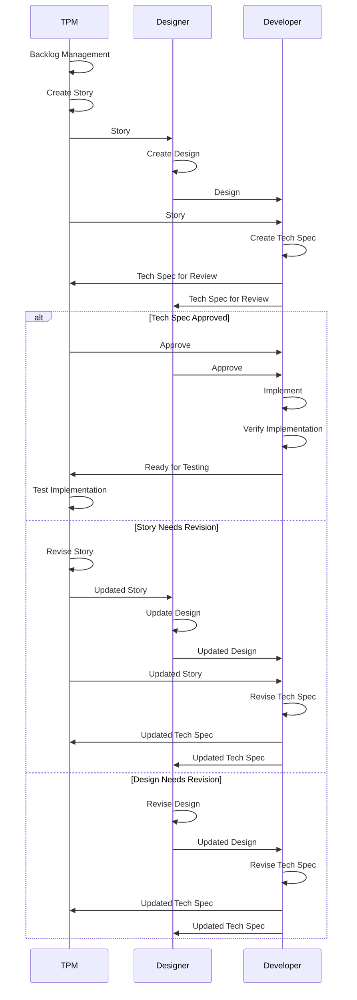

# development workflows

- volume and speed of AI output
	- natural throttles
		- human need/ability to understand
		- human need/ability to validate
- speed of dev delivery highlights pre/post-development tasks
    - story creation
    - story testing/validation
- basic situation
    - concern with value is constant
    - delivery speed is increasing
    - how do you 
	    - ensure quality does not decrease
	    - developers are not idle

## workflow scenario 1

This diagram shows the flow of work between TPM, Designer, and Developer roles in the development workflow.

## Key Phases

1. **Story Creation**: TPM manages backlog and creates story
2. **Design Phase**: Designer creates design based on story
3. **Tech Spec Phase**: Developer creates technical specification using story and design
4. **Verification**: All three roles verify the tech spec with possible outcomes:
   - **Approved**: Proceed to implementation
   - **Story Revision Needed**: Loop back to TPM to revise story, then through design and tech spec
   - **Design Revision Needed**: Loop back to Designer to revise design, then tech spec
5. **Implementation**: Developer implements and verifies the code
6. **Testing**: TPM tests the final implementation

## Feedback Loops

The diagram includes feedback loops that represent real-world scenarios where:
- Technical constraints discovered during spec creation require story changes
- Design elements need refinement based on technical feasibility
- Iteration happens before moving to implementation

## resources

- [ai-workflows](https://github.com/sdbroscious/ai-resources/tree/main/dev-of-future/resources/development-flows/ai-workflows)
- [spec-driven-design](https://github.com/sdbroscious/ai-resources/tree/main/dev-of-future/resources/development-flows/spec-driven-dev)