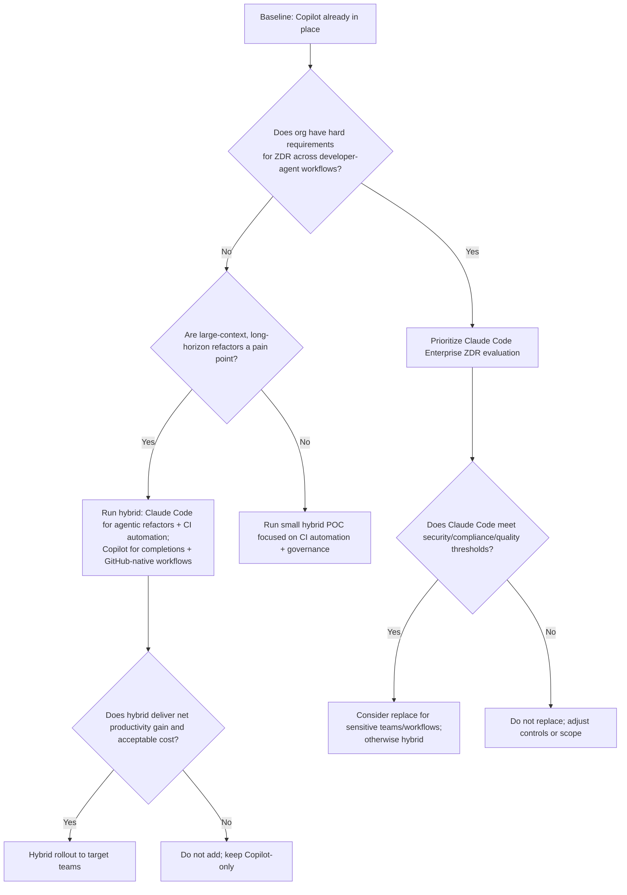
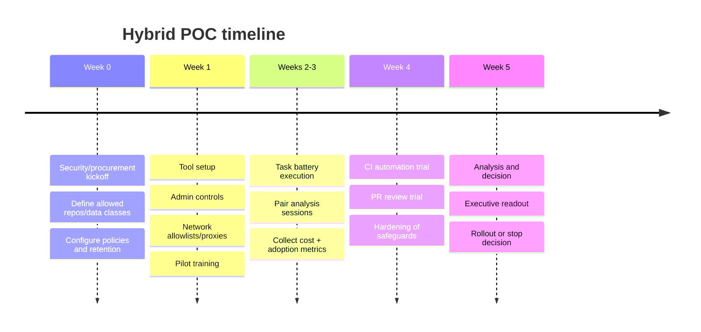

# Criteria to Decide Whether to Replace GitHub Copilot With Claude Code or Run Them Together in a Proof of Concept

## Executive summary

Your decision is less about “which model is smarter” and more about “which product harness fits your engineering system.” Today, Copilot can run across many foundations models (including Claude family models) and offers deep GitHub-native workflows (IDE completion + chat + agents that can raise PRs/issues, plus enterprise policy/metrics/admin surfaces). citeturn12view3turn14view1turn15view0 Meanwhile Claude Code is designed as an agentic developer surface (terminal-first plus IDE/web/desktop) with enterprise-grade controls that are unusually explicit for agent behavior (centralized permissions deny-lists, permission modes including “auto mode,” and an Enterprise Zero Data Retention option for Claude Code). citeturn11search35turn12view2turn3search4turn12view1

Given you already use Copilot, the lowest-risk, highest-signal path is a **hybrid POC (augment, not replace)**: keep Copilot for inline completion and GitHub-native capabilities, and add Claude Code for a strategically chosen subset of workloads that stress agentic operation and long-horizon changes (multi-file refactors, repo exploration, CI-automated PR creation/review, and large-context sessions). This recommendation is driven by:  
- Copilot’s strong IDE completion feature set (including “next edit suggestions”) and broad editor coverage. citeturn1search0turn11search18  
- Claude Code’s explicit agent controls plus large-context options (up to 1M context for supported models/plans) and native automation surfaces (GitHub Actions integration and a code-review agent). citeturn4search19turn10search1turn10search19turn12view1  
- The fact that Copilot already offers access to Claude models in chat for many plans, meaning “switching to Claude” can sometimes be accomplished inside Copilot—so the incremental value of Claude Code must come from **workflow + governance + context + automation**, not merely model brand. citeturn12view3turn1search6

Replacement becomes rational primarily under one (or more) of these conditions:  
- You need Claude Code’s Enterprise **Zero Data Retention** behavior for developer-agent workflows, and Copilot’s retention behavior (IDE non-retained vs 28-day retained for other surfaces) is incompatible with your risk posture. citeturn12view1turn14view0turn15view0  
- You depend on extremely large-context, long-horizon refactors where Claude Code’s 1M context availability is a material advantage and Copilot product-level context limits are insufficient for your repos (even if underlying models support larger contexts). citeturn4search19turn9search0  
- Your organization is not on GitHub Enterprise Cloud and needs on-prem GitHub (GitHub Enterprise Server), in which case Copilot is “not currently available.” (This may not apply since you already use Copilot, but it is a hard constraint for some orgs.) citeturn12view3

## Decision criteria and product capability mapping

### Product posture and “what each tool is optimized for”

Copilot is positioned as a GitHub-integrated developer platform feature set—autocomplete in the editor, chat across IDE/GitHub/Mobile/terminal, and agent capabilities including agent mode and a coding agent that can work on issues and produce PRs you review. citeturn1search0turn12view3turn5search2turn5search1 Copilot Enterprise is explicitly described as adding GitHub.com integration and deeper customization, including codebase indexing and fine-tuned private models for inline suggestions. citeturn14view1turn12view3

Claude Code is positioned as an “agentic coding tool” that reads your codebase, edits files, runs commands, and integrates with dev tools across terminal/IDE/web/desktop, with explicit workflow documentation for exploration, debugging, refactoring, writing tests, and PR creation. citeturn11search35turn10search5turn10search3 It also includes an automation surface via “Claude Code GitHub Actions” (triggered by `@claude` mentions, for example) and a dedicated “Code Review” capability that posts inline PR comments. citeturn10search2turn10search19

A key strategic nuance: Copilot’s plan tables show that Copilot chat can use multiple Claude models (plus others), so model access alone is not a sufficient reason to migrate. citeturn12view3 Claude Code’s justification, therefore, should be tested as: “Does this agent harness + control plane + context behavior deliver incremental productivity/quality at acceptable risk and cost?”

### Comparison table with recommended action per criterion

The table below treats each criterion as a separate decision axis. “Unspecified” means the vendor does not publicly specify the behavior in primary sources, or it varies by plan/client in ways not clearly pinned down.

| Criterion | What to verify (POC lens) | Copilot reality (evidence-backed) | Claude Code reality (evidence-backed) | Recommended action | Rationale |
|---|---|---|---|---|---|
| Inline code completion | Speed/quality of inline suggestions; disruption if removed | Strong: inline suggestions and “next edit suggestions” in supported IDEs. citeturn1search0turn11search18 | Unspecified for “autocomplete-style completion” parity; VS Code extension emphasizes a chat/agent UI and diffs, not classic completion. citeturn11search9turn10search0 | **Hybrid** | Keep Copilot where it is already delivering low-friction completion value; test Claude Code primarily for agentic work. |
| Natural-language prompts & code generation | Task success for “implement feature” prompts | Chat in IDEs/GitHub/Mobile/terminal; agent mode can autonomously edit code and suggest terminal steps. citeturn11search18turn1search0turn1search8 | Terminal-first agent; documented workflows for implementing features and PRs. citeturn10search5turn11search35 | **Hybrid** | Both can generate code; decision tends to be workflow fit and governance rather than raw existence of capability. |
| Multi-file refactoring | Accuracy on cross-file edits; number of iterations | Agent mode determines which files to change and iterates. citeturn1search0turn1search8 | Designed to “work across multiple files and tools”; refactoring workflow documented. citeturn11search35turn10search5 | **Hybrid** | Test both on identical refactors; Claude Code may excel on “long-horizon” sessions, Copilot may excel when GitHub-native context (PR/issue) is central. |
| Test generation | Unit/integration test usefulness and correctness | Copilot completions can generate unit test snippets; broader test flows typically via agent mode and MCP. citeturn5search5turn9search6 | Testing workflow is explicitly documented; can run commands and iterate. citeturn10search5turn11search35 | **Hybrid** | Use the POC to measure “tests that pass on first run,” coverage deltas, and flake rate. |
| Code explanation & onboarding help | “Explain this subsystem” usefulness | Chat supports Q&A across multiple surfaces. citeturn11search18turn5search7 | Claude Code can explain complex code and codebase behavior. citeturn0search37turn11search35 | **Hybrid** | Both address explanation; measure time-to-understand and PR review cycles in the POC. |
| Context window & long sessions | Does it handle large repos without losing constraints | Copilot CLI offers auto-compaction near the token limit and “virtually infinite sessions,” but exact caps vary and aren’t consistently published as a single number per model/client. citeturn9search0turn9search3 | Supports extended context up to 1M tokens for certain models/plans, with explicit enable/disable controls. citeturn4search19turn14view3 | **Augment** | This is a prime “Claude Code differentiation” hypothesis: fewer iterations for large-context refactors. |
| Model choice / routing | Can you choose the “best model for task” | Copilot plans enumerate many available chat models (including Claude family) and supports changing the chat model. citeturn12view3turn1search6 | Primarily Claude models, but can run through third-party platforms (e.g., Bedrock/Vertex/Foundry) for some deployments; features may vary by provider. citeturn3search7turn10search13 | **Hybrid** | Copilot may remain the “model marketplace” inside the IDE; Claude Code is justified by harness + controls, not selection breadth. |
| IDE/editor coverage | IDEs where developers actually work | Broad editor coverage is explicitly documented (VS Code, Visual Studio, JetBrains, Vim/Neovim, Xcode, Eclipse, etc.). citeturn1search0turn11search18 | Documented in VS Code and JetBrains IDEs, plus terminal/web/desktop; plus Slack. citeturn10search3turn10search0 | **Hybrid** | If your org is multi-IDE, Copilot may remain baseline. Add Claude Code for teams whose workflows match its surfaces. |
| CI/CD automation integration | Automated PRs/reviews in pipelines | Copilot has GitHub-native coding agent flows and broader “agentic AI on GitHub” story; exact CI trigger patterns vary by feature. citeturn5search10turn5search4 | Explicit GitHub Actions integration (“@claude mention” etc.) and references to GitLab availability. citeturn10search2turn10search3 | **Augment** | Claude Code is strong where you want an explicit CI/CD agent you can wire into workflows and runners. |
| GitHub-native workflows | Issues → PRs, in-platform review/audit | Coding agent creates commits authored by Copilot, links to session logs, and enforces independent review (requester cannot approve PR). citeturn5search2turn5search1 | GitHub app–based Code Review and GitHub Actions integrations exist, but GitHub itself is not the “home surface.” citeturn10search19turn10search2 | **Hybrid** | If GitHub is your SDLC backbone, Copilot’s native workflow is hard to replace—use Claude Code where it adds clear incremental value. |
| Collaboration & shared sessions | True shared sessions vs artifacts | Sharing via artifacts like Copilot Spaces is supported. True “shared live agent session” is **unspecified** in official docs. citeturn5search20turn9search17 | Remote Control explicitly enables continuing a local session from another device; admin-controlled on Team/Enterprise. citeturn10search9turn3search10 | **Augment** | Claude Code appears to have more explicit “session mobility” features; measure whether your teams actually need this. |
| Enterprise policy controls | Centralized enforcement of safe behavior | Org/enterprise policy management and content exclusion exist; also allowlisting/blocking suggestions matching public code. citeturn12view3turn18search8turn18search1 | Server-managed settings can enforce deny lists (e.g., block reading `.env`, disable bypass), and permissions/auto mode are explicitly configurable. citeturn12view2turn3search4turn3search1 | **Hybrid** | Both have control planes; Claude Code is unusually explicit about agent permission semantics—use it where governance needs are higher. |
| Data retention | What is stored, where, and for how long | For Business/Enterprise defaults: IDE chat/completions “not retained”; other surfaces retain prompts/suggestions 28 days; engagement data kept 2 years; and Business/Enterprise data is not used to train models. citeturn14view0turn15view0 | Commercial default retention is 30 days; Enterprise can enable Zero Data Retention for Claude Code; local caching up to 30 days is configurable. citeturn12view1turn12view2 | **Hybrid** (or **Replace** if ZDR is mandatory) | If ZDR is a hard requirement for developer agents, Claude Code becomes strategically important; otherwise, tune Copilot surface usage to match your policy. |
| Telemetry & diagnostics | Can you disable telemetry? what is sent? | Telemetry underpins usage reporting; certain metrics require IDE telemetry to be enabled. citeturn16view1turn16view0 | Claude Code uses Statsig and Sentry for operational metrics/error logging, with environment variables to disable; `/feedback` sends conversation history. citeturn14view4turn12view1 | **Hybrid** | Both need a privacy posture; Claude Code’s telemetry toggles are explicitly documented; validate equivalence for your compliance program. |
| Compliance posture | SOC2/ISO/AI mgmt certifications, reports | GitHub enterprise compliance reports include SOC 2 Type 2 and ISO/IEC 27001:2022 (plus others); Copilot-specific compliance artifacts exist (e.g., SOC 2 Type I report scope announcement). citeturn1search3turn1search11 | Anthropic states SOC 2 Type I & II and ISO 27001:2022 and ISO/IEC 42001:2023 for commercial products, with artifacts in the Trust Center. citeturn14view5turn2search1 | **Hybrid** | Likely parity at a “certifications exist” level; your security review must validate scope, subprocessor chain, and contract terms. |
| Legal/IP risk controls | Code provenance, license matching, indemnity | Blocking suggestions matching public code checks ~150 characters of surrounding code; code referencing provides links to matching public code; product terms put responsibility for suggestions on you. citeturn18search1turn18search3turn14view2turn18search6 | Legal posture around Claude outputs/indemnity is documented at the commercial terms/news level; Claude Code has a legal/compliance page (e.g., BAA extension with ZDR for HIPAA contexts). citeturn7search2turn7search3 | **Hybrid** | Copilot has built-in provenance controls tightly integrated with GitHub; Claude requires process + tooling to manage provenance risk. |
| Indemnification | Is there uncapped indemnity and what conditions apply? | Official trust FAQ indicates uncapped IP indemnification with requirements (details are plan/config dependent). citeturn7search0 | Anthropic announces expanded copyright indemnity for commercial customers; Claude Code-specific indemnity scope is **unspecified** in public docs beyond general commercial terms references. citeturn7search2turn12view1 | **Hybrid** | Treat indemnity as a procurement/legal decision: get contract language for both and map to your internal controls. |
| Cost model and TCO | Predictability vs usage-based tail risk | Business $19/user/mo; Enterprise $39/user/mo; premium request allowances and $0.04/additional request are explicit. citeturn0search10turn12view3 | Team seats: Standard $20/seat/mo annual ($25 monthly); Premium $100 annual ($125 monthly). Claude Code consumption is token-based; official docs cite average cost examples and variance. Enterprise seat covers access while usage is billed at API rates. citeturn4search4turn16view4turn14view3 | **Augment for POC** | With Copilot already deployed, run Claude Code on a bounded cohort and measure incremental cost per unit output (PRs, defects avoided, lead time reduced). |
| Migration complexity | Training, admin setup, workflow disruption | Already deployed; removing it can disrupt IDE muscle memory. Copilot also isn’t available on GitHub Enterprise Server. citeturn12view3 | Requires new admin plane + permission models; supports managed settings via admin console/MDM approaches. citeturn12view2turn3search1 | **Hybrid** | Hybrid minimizes disruption; replacement only after POC proves sustained advantage and governance readiness. |

### High-impact “differentiators” to test explicitly

If you want the POC to produce a clear, defensible decision, focus on the dimensions most likely to diverge materially:

Claude Code differentiator hypotheses:  
- **Long-horizon tasks and large-context refactors** (1M context availability + agent harness). citeturn4search19turn11search35  
- **Explicit agent governance** (central deny lists, permission modes, auto mode classifier controls, disable bypass). citeturn12view2turn3search4turn3search10  
- **CI-based “agent in the workflow”** patterns (GitHub Actions integration and PR Code Review). citeturn10search2turn10search19  

Copilot differentiator hypotheses:  
- **Best-in-class IDE completion workflow** and broad editor support. citeturn1search0turn11search18  
- **GitHub-native SDLC integration** (issues → PR agent flow, session logs, review constraints, and enterprise policy/metrics). citeturn5search2turn5search1turn16view0  
- **Provenance controls integrated into the product** (blocking and referencing suggestions matching public code). citeturn18search1turn18search6turn18search3  

## Model performance and quality considerations

### Why model benchmarks alone won’t settle this decision

Both products are “agent harnesses” around underlying LLMs, and Copilot can already route chat to multiple model families (including Claude models). citeturn12view3turn1search6 As a result, second-order effects often dominate: codebase ingestion strategy, tool-use loop design, context truncation/compaction behavior, and safety gates for executing commands. citeturn9search0turn1search0turn3search4

That said, model quality still matters for “hard” coding tasks (multi-file reasoning, fixing build/test failures, refactor correctness). Anthropic publicly reports strong SWE-bench Verified results for Claude models (e.g., Sonnet 4.5 and Opus 4.6). citeturn4search26turn6search24 Independent leaderboards (SWE-bench) provide additional cross-vendor context. citeturn6search5

### Practical performance dimensions to measure in your POC

Accuracy and hallucination (operational definition): Neither vendor publishes a single “hallucination rate” for coding assistants in a way that transfers to your repos, so treat this as **unspecified** and measure it locally. Copilot emphasizes that suggestions are probabilistic and that matching suggestions happen rarely, with a GitHub-cited figure of “less than 1%” match rate in their research (not a hallucination rate, but relevant to provenance risk). citeturn15view1turn18search1 Claude documentation includes guidance for evaluation/guardrails in general, but again not a single coding hallucination scalar for your environment. citeturn3search24

Latency: Claude Code introduces “fast mode” that admins must explicitly enable and which bills differently, implying an explicit latency/cost tradeoff control. citeturn3search19 Copilot’s latency varies by model, client, and “premium request” routing; exact SLOs are **unspecified** publicly. citeturn12view3turn9search2

Context windows: Claude Code explicitly documents 1M context support for certain model variants and plans, plus an option to disable 1M context if undesired. citeturn4search19 Copilot CLI explicitly documents context compaction and a `/context` visualization command, but product caps can differ from underlying model maxima and are not consistently published as a single enterprise-ready guarantee. citeturn9search0turn9search3

### A defensible measurement framework

To avoid subjective “it feels better” outcomes, use these measurable proxies:

- **First-pass success**: percent of tasks where the agent produces a passing build/test suite without human edits beyond prompt clarifications. (Measure separately for feature work vs refactors vs test generation.) citeturn1search0turn11search35  
- **Iteration count**: number of agent cycles to reach “tests green + reviewable diff.” (Agent harness quality shows up here, not just model IQ.) citeturn1search0turn10search5  
- **Defect leakage**: post-merge incidents/bugs linked to AI-generated PRs vs baseline. (Your own SDLC telemetry is the ground truth; vendor claims are not substitutes.) citeturn6search4turn6search35  
- **Acceptance rates**: Copilot provides “code completion acceptance rate” and other usage metrics; Claude Code provides acceptance/rejection rates for tools like Edit/Write and PR/line contribution metrics (with caveats). citeturn16view0turn16view3turn16view2  

## Security, data handling, compliance, and legal risk

### Data retention and training posture

Copilot’s Business/Enterprise defaults distinguish between IDE usage and other surfaces: IDE chat/completions prompts/suggestions are “not retained,” while “all other” access retains prompts/suggestions 28 days; user engagement data is kept two years. citeturn14view0 Copilot also states it does not use Business/Enterprise data to train its models. citeturn15view0

Claude Code retention is explicitly segmented by account type. For commercial use (Team/Enterprise/API), the standard retention is 30 days, and an Enterprise “Zero Data Retention” option is available for Claude Code, enabled per organization; local caching for session resumption can store sessions locally up to 30 days (configurable). citeturn12view1

Implication: the POC must decide which surfaces are allowed for each tool. If you need near-zero retention for all developer-agent interactions, you cannot treat “IDE only” as your entire usage pattern, because the most agentic features often involve multi-step sessions and tooling outside the IDE. citeturn14view0turn10search2turn10search1

### Telemetry and diagnostics

Claude Code documents operational telemetry via entity["company","Statsig","product analytics"] and entity["company","Sentry","error monitoring"], with environment variables to disable telemetry and error reporting; it also explicitly notes `/feedback` sends a copy of full conversation history (including code) to Anthropic. citeturn14view4turn12view1

Copilot’s metrics documentation indicates that telemetry underpins activity tracking and that certain fields require telemetry enabled in the IDE to be reflected. citeturn16view1turn16view0

Implication: your security/compliance review should treat “telemetry controls” as part of the tool configuration baseline, not an afterthought.

### Enterprise controls, policy enforcement, and safe agent execution

Claude Code provides unusually explicit enterprise control points for agent behavior, including:  
- centrally managed settings delivered via server-managed settings (or endpoint-managed/MDM approaches), with examples like deny listing `.env` reads and disabling bypass permissions. citeturn12view2turn3search10  
- a permissions model and auto-mode classifier that is explicitly designed to block risky actions (e.g., potential exfiltration), and avoids reading allow rules from repo-committed shared settings to reduce injection risk. citeturn3search4turn3search7  

Copilot provides:  
- content exclusion that prevents specified files from affecting suggestions/chat/code review. citeturn18search8turn18search0  
- network routing controls and allowlisting for enterprise environments (a sign that you will manage connectivity explicitly in many org settings). citeturn8search7turn8search0  
- a trust posture for Business/Enterprise data (no training) and plan-level policy management. citeturn15view0turn12view3turn18search22  

### Compliance certifications and audits

For GitHub enterprise contexts, GitHub’s compliance reports include SOC 2 Type 2 and ISO/IEC 27001:2022 certification among other artifacts, accessible in enterprise settings. citeturn1search3 GitHub also announced availability of compliance reports for Copilot Business/Enterprise (including a SOC 2 Type I report scope statement) via its changelog. citeturn1search11

For Anthropic commercial products, Anthropic states SOC 2 Type I & II and ISO 27001:2022, plus ISO/IEC 42001:2023 (AI management systems). citeturn14view5turn2search1

Implication: compliance artifacts exist on both sides, but your review must validate **scope** (which services, which regions, which subprocessors, which controls are in-scope for the exact plan you’re buying).

### Legal/IP risk: provenance, matching code, and indemnity

Copilot provides multiple mechanisms tied to public-code similarity: blocking suggestions matching public code checks suggestions against public code using surrounding context (~150 characters), and “code referencing” provides references when matches occur. citeturn18search1turn18search3turn18search6 GitHub’s terms clarify you retain ownership of your code and responsibility for suggestions you choose to incorporate, and that you must comply with licenses if you allow suggestions matching public code. citeturn14view2turn18search1 GitHub also cites a research finding that matching suggestions occur in rare instances (“less than 1% based on GitHub’s research”). citeturn15view1

For indemnification, GitHub’s official trust FAQ indicates uncapped IP indemnification for Copilot Business/Enterprise subject to requirements (details are contract/config dependent). citeturn7search0 On the Anthropic side, Anthropic announced expanded legal protections and copyright indemnity in its commercial terms update; Claude Code’s legal/compliance page also discusses how a BAA can extend to Claude Code if Zero Data Retention is enabled (HIPAA context). citeturn7search2turn7search3

Implication: even if one tool has more explicit provenance controls, both still require you to operate as if AI output is a third-party contribution: enforce license scanning, code review rigor, and documentation of human oversight in the SDLC.

## Economics, productivity impact, and operational fit

### Licensing and cost models

Copilot pricing for orgs is explicit: Copilot Business is $19 USD per user per month and Copilot Enterprise is $39 USD per user per month, with the ability to buy additional premium requests at $0.04/request (allowances depend on plan). citeturn0search10turn12view3

Claude Code is bundled into Claude plans in multiple ways. Anthropic’s pricing page shows Claude Team “standard seat” at $20/seat/month annually ($25 monthly) and “premium seat” at $100 annually ($125 monthly). citeturn4search4 Claude Enterprise pricing differs: the seat fee covers access and **usage is billed separately at standard API rates** (a materially different budgeting model). citeturn14view3

Claude Code’s own cost guidance is explicit that it consumes tokens and that costs vary by codebase size and conversation length; it provides an example distribution (average $6 per developer per day; under $12 for 90% of users) and a monthly range estimate (roughly $100–200/dev/month with Sonnet 4.6, with large variance). citeturn16view4

Implication: if you add Claude Code on top of Copilot, you must treat cost as a first-class success criterion and design the POC to capture marginal cost per measurable output.

### Productivity evidence and what it does (and does not) prove

GitHub has published controlled-experiment and survey-based research suggesting substantial time savings and developer satisfaction improvements with Copilot (e.g., a reported 55% faster completion on a task in a controlled experiment and improved subjective experience). citeturn6search0turn6search10 GitHub also published an enterprise-focused report with entity["company","Accenture","management consulting"] describing adoption and satisfaction outcomes in a corporate setting. citeturn6search6 The ACM has also summarized case-study style approaches to measuring Copilot impact. citeturn6search4

These sources are useful for **what to measure**, but they do not answer whether Claude Code is better for your repos and workflows. For Claude Code, Anthropic provides analytics tooling that tracks contribution metrics (PRs with Claude Code involvement, lines of code with Claude Code) and explicitly notes the metrics are conservative underestimates. citeturn16view2turn16view3

Implication: your decision should be based on internal measurements using the same KPIs for both tools, rather than extrapolating from vendor benchmarks or generic industry claims.

### Operational fit and migration complexity

If Copilot is already embedded into your developers’ IDE muscle memory, the biggest migration risk is not feature checklists—it’s friction: “thinking in completions” vs “thinking in agent sessions,” training burden on safe prompting, and changes to review/testing discipline. Copilot also has platform constraints (e.g., not available for GitHub Enterprise Server). citeturn12view3 Claude Code, conversely, introduces a new admin surface and a richer permission model that you must configure and govern centrally for safe scaling. citeturn12view2turn3search1

Implication: start with an augmenting POC, then decide on replacement only if the incremental benefit is strong and stable.

## Proof-of-concept evaluation plan

### POC objective and decision logic

The POC should answer a single question: **Does adding Claude Code to an existing Copilot environment improve delivery speed and/or quality enough to justify incremental cost and governance complexity, without increasing security/legal risk beyond acceptable thresholds?** This framing aligns with the reality that Copilot already supports Claude models in chat, so Claude Code must win on harness + governance + context + automation. citeturn12view3turn4search19turn12view2

A simple decision flow:



### Scope and participants

A pragmatic POC cohort is 20–50 developers across at least two archetypes:  
- teams doing high-churn feature work (frontend/backend) where completion speed matters;  
- teams doing deeper refactors/platform work where multi-file reasoning and long context matter. citeturn1search0turn11search35turn4search19

Include at least one repo that is “big enough” to stress context (monorepo or large service) and one repo that represents typical work (mid-size service).

### Success metrics and instrumentation

Use metrics that you can compute from your existing SDLC plus each vendor’s measurement surfaces:

Core delivery metrics (primary):  
- Lead time for change (issue start → merge) and cycle time (PR open → merge).  
- Review time and number of review rounds.  
- Deployment frequency (if you can attribute to the pilot cohort) and change failure rate.  

Quality/safety metrics (non-negotiable thresholds):  
- Build/test pass rate on first agent-generated PR.  
- Post-merge defects, rollback rates, and security scan regressions (CodeQL/other).  
- License scanning flags for new code (especially when public-code matching is allowed). citeturn18search1turn18search6turn11search29  

Tool usage/adoption metrics (to interpret outcomes):  
- Copilot: code completion acceptance rate, agent adoption, chat requests per active user, and active user counts are available in usage metrics dashboards/APIs. citeturn16view0turn18search16  
- Claude Code: PRs with Claude Code involvement and lines of code with Claude Code are available, with stated conservative counting; an Admin API exists for productivity and tool acceptance/rejection rates. citeturn16view2turn16view3  

Cost metrics (must be tracked weekly):  
- Copilot: seats + premium request consumption and any incremental premium request purchases ($0.04/request). citeturn12view3turn0search10  
- Claude Code: token usage and estimated costs; official guidance provides expected averages but requires your measurement because variance is large. citeturn16view4turn12view1

### Sample workloads and test cases

Design a standardized “task battery” that is representative, repeatable, and safe to inspect:

- Small feature addition (2–5 files, moderate tests).  
- Multi-file refactor (10–30 files) with a clear correctness harness (tests + static analysis).  
- Bug fix with reproduction steps and a failing test added first.  
- Test suite expansion task (write unit tests for an existing module; measure passing + meaningful assertions).  
- Dependency upgrade or modernization-like task (where applicable).  
- PR review task: run tool-driven review on the same PR diff and score signal-to-noise and missed issues. citeturn10search19turn5search19turn5search30  

Where possible, use GitHub-native automation for both tools: Copilot’s coding agent flow (issue → PR) and Claude Code GitHub Actions (e.g., `@claude` mention) to compare end-to-end behavior under CI constraints. citeturn5search1turn10search2turn10search1

### Timeline and stakeholders

A practical timeline that produces measurable outcomes without dragging:



Required stakeholders (minimum viable governance):  
- Engineering leadership (success criteria + adoption).  
- Security/GRC (data retention, telemetry, network routing, incident response alignment).  
- Legal/IP counsel (indemnity requirements, OSS licensing workflow).  
- Procurement/Finance (TCO).  
- Developer experience / platform engineering (IDE images, managed settings, SSO/SCIM). citeturn12view2turn18search22turn14view3  

### Data handling safeguards for the POC

Baseline safeguards for Copilot:  
- Enable content exclusion for sensitive files (keys, secrets, proprietary data dumps) so they do not inform suggestions or chat. citeturn18search8turn18search0  
- Turn on “block suggestions matching public code” unless there is a specific business reason to allow it; use code referencing when allowed. citeturn18search1turn18search6turn18search3  
- Constrain network behavior via enterprise allowlisting/subscription-based routing where appropriate. citeturn8search7turn8search0  

Baseline safeguards for Claude Code:  
- Use managed settings to deny reading secrets paths (e.g., `.env`, `secrets/**`) and to disable bypass-permissions mode. citeturn12view2turn3search10  
- Validate retention mode (standard 30-day vs Enterprise ZDR) and confirm local caching settings for pilot endpoints. citeturn12view1turn14view3  
- Establish proxy/firewall allowlists and required network paths, since internet connectivity is required and enterprise deployments often need explicit allowlisting. citeturn17search2turn17search0  

### Decision thresholds

Set explicit thresholds so the POC ends with a decision, not debate:

Adopt (hybrid expansion) if all are true:  
- ≥10–15% improvement in lead time or cycle time on the targeted workload class (refactors, CI PR automation, etc.).  
- No statistically meaningful increase in escaped defects or critical security findings vs baseline.  
- Incremental cost per developer stays within a budget envelope you define (e.g., <$X/dev/month incremental), using measured token usage + premium requests. citeturn16view4turn12view3  

Consider replace only if:  
- Claude Code meets or exceeds Copilot on your org’s highest-value daily workflow (often IDE completion + quick edits) **or** you can retire Copilot due to policy constraints (e.g., ZDR requirement) without material productivity loss. citeturn1search0turn12view1turn14view0  

Stop (do not add Claude Code) if:  
- The POC shows marginal speed gains but increased rework/defects, or  
- governance overhead (permissions, policies, incident response needs) is too high for the realized value, or  
- costs exceed the threshold without measurable throughput improvement. citeturn12view2turn16view4  

### Vendor questions and security/compliance checklist

Vendor questions (ask both vendors, tailored to your plan):  
- Data retention: confirm retention by surface (IDE vs CLI vs agents vs web), deletion SLAs, and whether “not retained” means not written to disk/logs at all. citeturn14view0turn12view1  
- Training: confirm whether Business/Enterprise data is ever used for training or evaluation, and how opt-in programs work. citeturn15view0turn12view1  
- Telemetry: list telemetry endpoints and data fields; confirm how to disable and what breaks when disabled. citeturn14view4turn16view1  
- Indemnity: provide contract language, scope, and operational requirements (e.g., filters that must be enabled). citeturn7search0turn7search2  
- Roadmap: planned changes to agent autonomy controls (e.g., Claude Code auto mode rollout) and major deprecations or model retirement schedules. citeturn3search7turn11search3  

Security/compliance review checklist (POC gate):  
- Confirm SOC2/ISO evidence and scope for the exact services being used (IDE extensions, web sessions, CI actions, agents). citeturn1search3turn14view5turn1search11  
- Confirm DPA availability and GDPR posture for your data controller/processor relationship. citeturn13search0turn14view0  
- Validate access controls: SSO/SCIM availability, role-based permissions, and audit logging availability and retention. citeturn18search2turn3search3turn14view3  
- Validate content exclusion and secret-handling controls (deny lists, MCP allowlists, workspace trust models). citeturn18search8turn12view2turn3search4turn9search6  
- Validate CI permissions for GitHub apps/actions (principle of least privilege; repository permission scoping). citeturn10search19turn10search2  

### Source index

```text
GitHub Copilot plans/features/pricing:
https://docs.github.com/en/copilot/get-started/plans
https://docs.github.com/en/copilot/get-started/features
https://github.com/features/copilot

Copilot governance, metrics, and controls:
https://docs.github.com/en/copilot/how-tos/configure-content-exclusion/exclude-content-from-copilot
https://docs.github.com/en/copilot/concepts/context/content-exclusion
https://docs.github.com/en/copilot/reference/copilot-usage-metrics/copilot-usage-metrics
https://docs.github.com/en/copilot/reference/metrics-data

Claude Code docs and enterprise controls:
https://code.claude.com/docs/en/overview
https://code.claude.com/docs/en/data-usage
https://code.claude.com/docs/en/server-managed-settings
https://docs.anthropic.com/en/docs/claude-code/github-actions
https://code.claude.com/docs/en/code-review
https://www.anthropic.com/pricing
```

Do you want me to create a markdown file of my response