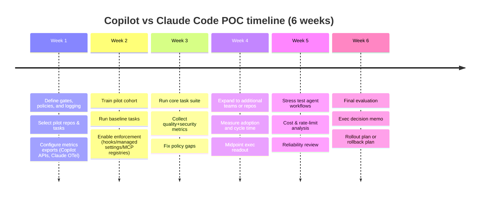

# Criteria for Replacing GitHub Copilot With Claude Code or Running Both in an Enterprise POC

> this was frm ChatGPT (GPT-5.4 deep research) after running the original prompt through [OpenAI Prompt Optimizer](https://platform.openai.com/chat/edit?models=gpt-5.4&optimize=true)). The original prompt is in generate claude-code-poc-criteria.md.

>The revised prompt:

```txt
my organization is planning a claude code poc; we already use github copilot (IDE and CLI); what criteria should we consider using to help us decide whether to replace copilot with claude code or use claude code in addition to copilot? Respond with: (1) decision criteria grouped by category, (2) a side-by-side evaluation framework or scorecard, and (3) a concise recommendation template. If important assumptions are missing, state them explicitly and proceed with reasonable defaults rather than asking follow-up questions. Keep the answer concise and practical.
```

## Executive summary

Organizations evaluating **GitHub Copilot** vs **Claude Code** usually face a “workflow shape” decision more than a pure “model quality” decision. Copilot is optimized for continuous IDE assistance (inline suggestions + chat + deep GitHub platform integration), while Claude Code is optimized for agentic, multi-step work (reads codebases, edits files, runs commands, and can be governed through permissions, hooks, and org-managed settings). Claude Code’s official docs explicitly describe it as an agentic coding tool available in terminal/IDE/desktop/browser. citeturn1view0

Under typical enterprise defaults (Copilot Business/Enterprise, GitHub Enterprise Cloud, strong need for always-on inline suggestions, and a preference for contractual IP protections), the most defensible path is usually:

**Recommendation (default): run Claude Code alongside Copilot in a time-boxed proof-of-concept, not a full replacement—unless your POC proves Claude Code can meet “always-on IDE completion” expectations and you’re willing to give up Copilot’s indemnification posture and/or GitHub-native workflows.**  
This is because Copilot offers (a) mature IDE-centric workflows and governance controls, (b) explicit IP indemnification for unmodified suggestions when its filtering is enabled, and (c) predictable per-seat pricing for Business/Enterprise; while Claude Code tends to win on (a) agentic autonomy primitives (permissions, sandboxing, hooks), (b) portability/deployment flexibility across cloud providers (Bedrock/Vertex/Foundry) and proxies, and (c) deep observability via OpenTelemetry exports. citeturn11view0turn7view0turn9view0turn1view1turn12view1turn5view0

Two near-term “gotchas” that matter in 2026 procurement and risk reviews:

- **Training/data use policy drift (individual tiers):** GitHub announced that interaction data from Copilot Free/Pro/Pro+ will be used to train/improve models unless users opt out, effective April 24, 2026; GitHub states Business and Enterprise are not affected by that update. citeturn5view3  
- **Data retention differs by surface/tooling:** for Copilot Business/Enterprise, prompts/suggestions are “not retained” in the IDE for chat/completions, but “all other access and use” is retained for 28 days (and user engagement data is retained longer). citeturn6search8  
  Claude Code’s retention defaults differ by plan, and **Zero Data Retention (ZDR)** is an enterprise-only configuration that changes what is stored and disables some features. citeturn4view0turn3search1

## Scope, assumptions, and decision framing

### What is being compared

- Claude Code is described by its vendor as an agentic coding tool that can read a codebase, edit files, and run commands, and is available through terminal and IDE integrations. citeturn1view0  
- Copilot is a suite of IDE and GitHub-surface features (inline suggestions, IDE chat, CLI/agent modes, code review/PR summaries, etc.) with org-level policy controls. citeturn5view0turn12view1

This report treats the decision as: **(A) replace Copilot seats with Claude Code seats**, or **(B) add Claude Code to a subset of developers/use cases while retaining Copilot as the default IDE assistant**.

### Important missing assumptions (stated explicitly) and reasonable defaults

Because your org details weren’t provided, the “sample scoring” and the POC plan assume:

- You are (or will be) on **Copilot Business or Copilot Enterprise**, not individual tiers, because enterprise policy control and contractual commitments typically require it. citeturn5view0turn5view3  
- Your repos are primarily on GitHub Enterprise Cloud, and GitHub-native workflows (PRs, Actions) matter. (If you are GitHub Enterprise Server-only or have strict data residency requirements, weights should shift toward portability/residency controls.)  
- You have a baseline enterprise requirement set: SSO, auditability, DPA, and strong controls on sensitive code and tool execution. Claude Code Enterprise is positioned as adding SSO, role-based permissions, compliance API access, and managed policy settings. citeturn7view0  
- Your developer workflow includes significant IDE time where inline completions are valuable (a key differentiator).  
- You are not air-gapped; both products rely on cloud model inference.

### Decision flow

```mermaid
flowchart TD
  A[Define hard gates\n(Security/Compliance, Data retention, Training use, SSO/SCIM)] --> B{Do you require\nalways-on IDE inline completions\nas a primary workflow?}
  B -->|Yes| C[Keep Copilot as baseline\nRun Claude Code alongside\nfor agentic tasks/CLI/CI]
  B -->|No| D{Do you require\nCopilot-specific GitHub workflows\n(e.g., Spaces, GitHub-native agent controls,\nCopilot governance)?}
  D -->|Yes| E[Prefer Copilot or hybrid\nEvaluate Claude Code for specific teams]
  D -->|No| F[Consider replacement track\nif Claude Code meets gates\nand productivity KPIs]
  C --> G[POC: measure productivity, risk, cost,\npolicy compliance, and reliability]
  F --> G
  E --> G
```

The “hard gates” concept is important: a higher weighted score should **not** override a failure on a non-negotiable requirement (e.g., “prompts retained longer than policy allows” or “no workable audit trail”).

## Decision criteria with measurable subcriteria

Below are the decision criteria categories you requested, each with measurable subcriteria. These are structured so you can test them during a POC and/or confirm them contractually.

**Security & compliance**
- Attestations available and in-scope for the product (e.g., SOC 2 type and ISO scope) and ability to obtain reports through official channels (yes/no; report type; scope statement). Copilot has announced SOC 2 Type I availability for Copilot Business and ISO 27001 scope inclusion. citeturn26search0  
- Identity & access controls: SSO support, SCIM provisioning, role-based administrative permissions (yes/no per feature; time-to-provision users; deprovision latency). Claude Enterprise includes SCIM and audit logs per plan description. citeturn24view0  
- Tool-execution safety controls: ability to require approvals for shell commands/file writes; ability to centrally deny high-risk patterns; ability to prevent bypass/unsafe modes (policy enforceability; percent of “autonomous actions” pre-approved vs blocked). Claude Code emphasizes permission-based architecture, read-only defaults, and explicit approval for commands; it also supports sandboxing and write scope restrictions. citeturn1view1turn4view1  
- Supply chain & extension risk: controls over MCP servers/plugins/extensions (allowlist/registry policy; signed artifacts; source review requirements; ability to block unapproved servers). Copilot supports MCP policy management including allowlisting via registries. citeturn11view3  
- Security scanning alignment: ability to prevent vulnerable patterns and credential leaks via hooks or scanners integrated into agent workflows (coverage % of agent actions passing checks). Copilot’s CLI hooks are explicitly positioned for logging and blocking risky tool execution patterns. citeturn12view3  

**Data privacy & residency**
- Training on your data: contractually and technically enforceable commitment that enterprise prompts/outputs are not used for training (yes/no; scope by feature; carve-outs for previews/betas). GitHub states Business/Enterprise aren’t affected by the April 2026 training-policy update for individual tiers. citeturn5view3  
- Retention by surface: prompt/output retention duration (IDE vs CLI vs agent/other surfaces), plus retention for telemetry/engagement metadata (days). citeturn6search8turn4view0  
- ZDR availability: whether “zero retention” is available, how it’s enabled, and what features are disabled/impacted under ZDR (yes/no; time-to-enable; list of disabled features; monitoring/audit changes). Claude Code documents ZDR availability for Claude for Enterprise and notes certain features are not covered or are disabled. citeturn3search1turn4view2  
- Data residency controls: ability to pin inference region and/or storage region (supported geos; per-request vs workspace defaults; contractual guarantees). Anthropic documents inference location controls via `inference_geo` and separate workspace geo controls. citeturn3search2turn3search22  
- Encryption and handling: encryption in transit; encryption at rest; local caching behavior and configurable retention on endpoints (yes/no; max days; locations). Claude Code’s data usage docs describe TLS in transit and local client caching (configurable) and note that data is not encrypted at rest on their side in the default flow described. citeturn4view0  

**Model capabilities & accuracy**
- Benchmark performance relevant to your workloads (choose 2–3 representative benchmarks and internal tasks). For external reference, SWE-bench evaluates models on real GitHub issues; Aider’s polyglot benchmark tests multi-language editing success. citeturn17view3turn17view1  
- Agent reliability metrics: task success rate without human intervention (%), tool-call correctness (%), rollback frequency (#/100 tasks), and “time-to-green-tests” for bugfix tasks.  
- Context handling: effective context window for large repos (measured by “files read per task before degradation,” or “max LOC summarized with acceptable error rate”). Claude Opus 4.6 is described as adding a very large context window (1M tokens in beta) in Anthropic’s release notes. citeturn16search0  
- Multi-file refactor quality: compile/test success rate; number of corrective iterations; diff quality (lint violations per 1k LOC changed).

**Language and framework support**
- Coverage across your top languages/frameworks (list them; score by “works well / works / limited”).  
- IDE telemetry/analytics language breakdown availability (can you get acceptance rate by language? yes/no). GitHub’s Copilot usage metrics provide breakdowns by IDE, language, and model, per docs. citeturn12view1  
- Test framework awareness: ability to run and interpret your test tooling (pytest, junit, etc.) measured by “pass rate after first change” and “time-to-fix failing tests”.

**IDE/CLI integration and workflow**
- IDE support matrix: your core IDEs supported, minimum versions, and feature parity (inline suggestions vs chat vs agent edit mode). GitHub publishes supported IDE versions for usage metrics inclusion (useful as a proxy for “supported+instrumented”). citeturn12view2  
- CLI/agent workflow capability: can it run commands, edit multiple files, and iterate to completion with governance enforcement? Claude Code is explicitly designed for file edits + command execution with permissions. citeturn1view0turn1view1  
- Git workflow automation: PR creation, code review automation, CI integration. Claude Code provides a GitHub Actions integration triggered by `@claude` mentions and highlights that code runs on GitHub runners. citeturn14view0  
- Enterprise policy propagation: time for policy changes to take effect; ability to prevent user overrides. Claude Code supports endpoint-managed settings and server-managed settings; documentation notes beta limitations and caching/polling behavior. citeturn9view1  

**Latency & availability**
- Time-to-first-token and time-to-completion (p50/p95) on your standard tasks.  
- Uptime history and incident responsiveness: track provider status pages and your observed IDE error rates; include “work stoppage minutes per developer-week.” GitHub’s Feb 9, 2026 availability report explicitly notes Copilot was impacted during degraded availability. citeturn20view0  
- SLA/credits: what uptime commitments exist and what credits apply. GitHub’s Online Services SLA commits to 99.9% uptime for listed service features and defines credits mechanics. citeturn25view0  
- Degraded-mode behavior: local fallback (none), cached context behavior, rate-limit handling, and retry/backoff controls.

**Cost & licensing**
- Seat price and entitlements: per-user monthly seat cost; what is included; what triggers overage. GitHub documents Copilot Business ($19/user/month) and Copilot Enterprise ($39/user/month) with additional premium request costs. citeturn22search25  
- Metered usage levers: “premium requests” overage for advanced features/models, and how quickly a team can burn through the included allotment (requests/user/day). citeturn22search29  
- Claude Code plan economics: seat vs usage-billed model; whether usage is included or billed via API rates; availability of spend limits and per-workspace budgets. Claude Code documents spend limits for API usage and cost visibility via `/cost`. citeturn9view2turn8search6  
- Total cost of adoption: training time, policy engineering (hooks/MCP registries), and possible observability stack costs (OTel collector, SIEM pipelines).

**Vendor lock-in & portability**
- Model/provider portability: ability to run through different cloud providers or gateways; ability to pin model versions. Claude Code’s enterprise deployment overview describes deployment via Anthropic directly or through cloud providers and recommends pinning model versions for provider deployments. citeturn7view0  
- Hosting platform dependence: impact if you ever move repos off GitHub; whether feature quality degrades. GitHub states Copilot works in editors regardless of code hosting platform, with some features enhanced by GitHub context. citeturn5view1  
- Exportability of prompts/telemetry: can you export usage metrics and/or logs for long-term storage (yes/no; formats; retention).

**Observability/auditability**
- Audit log coverage: what events are logged (admin changes vs user interactions vs agent actions), retention window, and export format. Copilot Business audit logs list events for the last 180 days; agentic audit logs can be filtered at enterprise level and also cite a 180-day view window. citeturn4view3turn12view0  
- Usage telemetry APIs: availability of per-user adoption, acceptance rates, and LoC metrics; and whether telemetry is optional (and thus incomplete). GitHub documents usage metrics and notes IDE telemetry must be enabled to be reflected in many metrics. citeturn12view1  
- Real-time observability integration: OpenTelemetry or equivalent exports (logs+metrics), default intervals, and ability to centrally enforce instrumentation. Claude Code supports exporting metrics and logs via OpenTelemetry and describes centralized configuration via managed settings. citeturn9view0  
- Forensics readiness: ability to reconstruct “why did the agent do this” from logs without storing raw prompts (event schemas, tool call logs, policy decisions).

**Customization/fine-tuning**
- Org/project instructions: repository-scoped instructions, path-specific instructions, and prompt templates (file-based governance). GitHub documents `.github/copilot-instructions.md` and path-scoped instruction files. citeturn11view1  
- Deterministic enforcement: hooks that run on key lifecycle events to block actions, format code, inject context, and log for compliance. Claude Code positions hooks as deterministic controls that do not rely on the model “remembering” to do things. citeturn14view1  
- Extensibility standards: MCP server ecosystem governance. GitHub describes MCP as an open standard and provides org policy enable/disable controls. citeturn11view2turn11view3  
- Plugin/marketplace governance: ability to distribute vetted extensions across teams. Claude Code supports creating and distributing plugin marketplaces with version tracking and updates. citeturn14view3  

**Developer productivity & UX**
- Empirical impact: acceptance rate, cycle time, PR throughput, and developer satisfaction. GitHub published enterprise research with entity["company","Accenture","consulting company"] describing measured impacts and methodology. citeturn15view0  
- Friction factors: permission prompts, context setup burden, and “time-to-first-value” for new users. Anthropic describes building “auto mode” to reduce approval fatigue and notes observed prompt-approval rates. citeturn15view1  
- Quality-of-life features: session persistence, diff review UX, ability to safely delegate long-running refactors, and collaboration affordances (sharing, PR automation).

**Support & SLAs**
- Support responsiveness SLAs: response time for P1/P2 tickets, 24/7 coverage, escalation process. GitHub Premium Support includes explicit initial-response SLAs (e.g., 30 minutes for urgent). citeturn24view2  
- Uptime SLA posture: what is contractually provided for the service you’re buying; whether Copilot/agent features are covered or explicitly excluded; service credits process. citeturn25view0  
- Operational transparency: incident communications, postmortems/availability reports. GitHub publishes monthly availability reports including Copilot-impact incidents. citeturn20view0  

**Legal/IP and licensing**
- IP indemnification: whether the vendor offers contractual indemnity for generated code and the conditions. GitHub’s Copilot plans page states customers are entitled to IP indemnification for unmodified suggestions when filtering is enabled. citeturn11view0  
- Open-source contamination mitigations: code reference/public match suppression controls and verification workflow (thresholds, false positives). GitHub’s filter details include a threshold of “65 lexemes” (approx. 150 characters average) for suppression on public matches. citeturn5view1  
- Ownership of outputs and permitted uses: confirm in vendor terms; ensure policy covers training opt-ins for consumer tiers (not acceptable for enterprise code). Claude Code’s legal/compliance resources point to distinct consumer vs commercial terms and note BAA extension requires ZDR for covered traffic. citeturn24view1  

**Governance & policy**
- Policy orchestration: ability to centrally enable/disable features/models, third-party agents, or MCP. GitHub provides organization/enterprise policy controls and explicitly includes toggles for partner agents. citeturn5view0  
- Guardrails enforcement: allow/deny patterns for tools, enforced hooks, and prevention of user bypass. Claude Code supports centrally managed settings that can deny read/command patterns and disable bypass modes. citeturn9view1turn4view1  
- Segmentation: per-org/per-repo/per-group policies; preview/beta isolation. Claude Code server-managed settings documentation notes (during beta) settings apply uniformly and per-group configs are not yet supported—this is a measurable governance gap to account for. citeturn9view1  

## Side-by-side evaluation framework and sample scorecard

### Scoring rubric

Use a 1–5 scale per category; require evidence for 4–5 ratings.

- **5** = meets/exceeds enterprise requirement with strong controls, exports, and minimal compensating actions  
- **4** = meets requirement with minor gaps or extra configuration  
- **3** = usable but requires notable workarounds/limitations  
- **2** = significant gaps; only acceptable for narrow, low-risk use  
- **1** = unacceptable for enterprise use given your constraints

**Interpretation guidance**
- Treat **any score ≤2** in a “hard gate” category (privacy, compliance, governance, legal/IP) as a *stop* unless you can mitigate with enforceable controls and contract terms.  
- If overall weighted scores differ by **<0.25**, prefer **hybrid** and let POC results decide.  
- If Claude Code wins mainly because of ZDR/residency, validate **feature tradeoffs under ZDR** (some analytics/features are restricted). citeturn3search1turn4view2  

### Suggested category weights (default enterprise profile)

Weights sum to 100 and should be adjusted to your risk posture.

```csv
category,weight
security_compliance,11
data_privacy_residency,10
model_capabilities_accuracy,10
language_framework_support,4
ide_cli_integration_workflow,10
latency_availability,8
cost_licensing,7
vendor_lockin_portability,5
observability_auditability,7
customization_finetuning,5
developer_productivity_ux,7
support_slas,4
legal_ip_licensing,4
governance_policy,8
```

### Sample scored example (reasonable defaults)

Default assumptions (for this example only):
- You are on Copilot Business/Enterprise with enterprise policy controls. citeturn5view0turn22search25  
- You will run Claude Code on an Enterprise plan with ZDR enabled (for sensitive code), accepting that some analytics features may be restricted under ZDR. citeturn3search1turn4view2  
- You value inline IDE completions heavily and prefer explicit IP indemnification for unmodified outputs, where available. citeturn11view0  
- You will measure reliability based on status/history plus internal observed downtime minutes; both vendors have had notable service incidents in 2026. citeturn20view0turn15view3turn20view3  

**Machine-readable Markdown table (14 categories)**

| Category | Weight | Copilot score (1–5) | Claude Code score (1–5) | Rationale snapshot |
|---|---:|---:|---:|---|
| Security & compliance | 11 | 4 | 4 | Both have enterprise security programs; Copilot has published compliance scope updates; Claude Code emphasizes permission-based safety. citeturn26search0turn1view1 |
| Data privacy & residency | 10 | 4 | 5 | Copilot has surface-dependent retention; Claude Code can be configured with ZDR on Enterprise. citeturn6search8turn3search1 |
| Model capabilities & accuracy | 10 | 4 | 4 | Both can access strong frontier models; validate on your internal tasks and agent harness. Copilot supports multiple model providers; Claude Code focuses on Claude models. citeturn1view2turn16search0 |
| Language & framework support | 4 | 5 | 4 | Copilot is broadly positioned across languages; Claude Code is strong but evaluate your stack specifically. citeturn12view1turn1view0 |
| IDE/CLI integration & workflow | 10 | 5 | 4 | Copilot is deeply IDE-centric; Claude Code is strong for agentic CLI + IDE integration but may not replicate continuous inline completion expectations for all teams. citeturn12view2turn1view0 |
| Latency & availability | 8 | 4 | 3 | Both have had incidents; GitHub publishes availability reporting; Claude has frequent status updates—measure your own downtime impact. citeturn20view0turn20view3 |
| Cost & licensing | 7 | 5 | 3 | Copilot Business/Enterprise pricing is documented; Claude Code Enterprise usage is billed at API rates and needs cost controls/spend limits. citeturn22search25turn9view2 |
| Vendor lock-in & portability | 5 | 3 | 4 | Copilot works outside GitHub but is enhanced by GitHub context; Claude Code can deploy across cloud providers and supports proxies/gateways. citeturn5view1turn7view0 |
| Observability & auditability | 7 | 4 | 5 | Copilot has usage metrics APIs + dashboards + audit logs; Claude Code adds OpenTelemetry logs/metrics plus an analytics admin API. citeturn12view1turn4view3turn9view0turn3search0 |
| Customization/fine-tuning | 5 | 4 | 5 | Copilot supports custom instruction files, hooks, MCP; Claude Code supports hooks, plugins, and plugin marketplaces for distributing extensions. citeturn11view1turn12view3turn14view1turn14view3 |
| Developer productivity & UX | 7 | 4 | 4 | Copilot has published enterprise productivity research; Claude Code reduces permission fatigue with safety-oriented automation—verify in your workflow. citeturn15view0turn15view1 |
| Support & SLAs | 4 | 4 | 3 | GitHub Premium Support includes response-time SLAs; Claude Enterprise support terms are typically contract-based—confirm in procurement. citeturn24view2turn24view0 |
| Legal/IP & licensing | 4 | 5 | 3 | Copilot offers IP indemnification when filtering is enabled; Claude Code legal posture depends on commercial terms/contract—confirm indemnities if needed. citeturn11view0turn24view1 |
| Governance & policy | 8 | 5 | 4 | Copilot provides org/enterprise policy controls (features/models/agents/MCP); Claude Code supports centrally managed settings but has beta limitations (uniform application; caching window). citeturn5view0turn11view3turn9view1 |

**Sample weighted totals (from the table above)**  
- Copilot: **4.28 / 5.00** (wins on IDE workflow maturity, documented seat economics, and explicit IP indemnification) citeturn11view0turn22search25  
- Claude Code: **3.99 / 5.00** (wins on ZDR-configurable privacy posture, OpenTelemetry observability, and extensibility via hooks/plugins/marketplaces) citeturn3search1turn9view0turn14view3  

This sample outcome is a strong indicator for **“alongside”** as the default enterprise decision—then let internal POC results determine whether Claude Code meaningfully replaces Copilot usage for your core developer workflows.

## POC tests, success metrics, rollout steps, and risk mitigations

### Required POC tests (minimum set)

Design tests around the *subcriteria* above, not vendor feature checklists.

1) **Representative engineering tasks (real repos, controlled scope)**
- Bugfix tasks: 10–20 historical issues with known patches, across your top 3 languages.  
- Refactor tasks: 5–10 multi-file refactors with tests and CI gates.  
- “Agent” tasks: dependency bump + fixes, migration scripts, CI config updates.

2) **Safety and governance tests (must-pass)**
- Attempt forbidden commands and sensitive-file access patterns and confirm enforcement via hooks/permissions/policies. Copilot CLI hooks are designed to log prompts and block high-risk tool executions. citeturn12view3  
- For Claude Code, validate deny rules, bypass prevention, and managed settings delivery behavior (including the documented “brief window” before server-managed settings load). citeturn9view1turn4view1  
- Validate MCP governance: registry allowlist enforcement and policy disable/enable behavior. citeturn11view3turn11view2  

3) **Privacy/retention validation**
- Confirm your plan selection and verify retention by surface:
  - Copilot: IDE vs non-IDE retention differences for Business/Enterprise. citeturn6search8  
  - Claude Code: commercial 30-day default vs Enterprise ZDR; confirm which features are excluded from ZDR. citeturn4view0turn3search1  

4) **Observability and audit readiness**
- Copilot: enable usage metrics API export and validate that telemetry opt-outs reduce completeness (expected); confirm audit log retention windows and event coverage. citeturn12view1turn4view3  
- Claude Code: send OpenTelemetry logs/metrics to your collector and confirm signal quality and cost/usage attributions; validate audit log export window. citeturn9view0turn9view3  

5) **Reliability and latency**
- Track failures and degraded periods using: (a) vendor status pages, (b) IDE error telemetry, and (c) internal “blocked minutes” reporting. GitHub’s Feb 2026 availability reporting is a reference for how to interpret systemic incidents impacting Copilot. citeturn20view0  

### Success metrics (practical, executive-readable)

Use a mix of **outcome** and **risk** metrics; avoid vanity metrics like “lines of code generated” in isolation.

- **Adoption & engagement**
  - % of pilot developers active weekly (target: ≥70% by week 4)
  - Sessions per active developer/week
- **Productivity**
  - Lead time for change (PR opened → merged) compared to baseline (target: 10–20% improvement in pilot cohort, normalized by task type)
  - “Time to first working patch” on bugfix tasks (median; target: ≥15% improvement)
- **Quality**
  - Test pass rate on first PR (target: no regression; ideally +5%)
  - Post-merge defect rate (target: no increase; ideally decrease)
- **Security & compliance**
  - # of blocked policy violations (should be >0 early; indicates controls are working)
  - Secrets exposure incidents attributable to AI assistance (target: 0)
- **Cost**
  - Cost per successful task (normalized): include seat cost + overages + engineering overhead
  - Overage triggers (Copilot premium requests; Claude Code token/cost spikes)
- **Reliability**
  - Blocked engineering minutes per developer-week due to tool outages or rate limits (target: below an agreed threshold)

### Rollout steps and mitigations (what “good” looks like)

- Start with **hybrid-by-design**: keep Copilot for IDE inline assistance while introducing Claude Code for agentic tasks in terminal/CI and for engineers who benefit from multi-step autonomy. This aligns with Copilot’s policy ability to control feature/model availability while you run controlled experiments. citeturn5view0  
- Establish **repo-level instruction discipline**:
  - Copilot: `.github/copilot-instructions.md` and path-specific instruction files for sensitive areas. citeturn11view1  
  - Claude Code: enforce CLAUDE.md conventions and check-in shared configuration where appropriate; Claude Code’s enterprise deployment guidance explicitly recommends org/repo-level CLAUDE.md deployment. citeturn7view0  
- Use **deterministic enforcement** everywhere:
  - Copilot CLI hooks for tool execution controls and prompt logging (with redaction). citeturn12view3  
  - Claude Code hooks to block edits, run formatters/tests, and log decisions; hooks are explicitly positioned as deterministic controls. citeturn14view1  
- Lock down extensibility:
  - Copilot MCP: configure an MCP registry and restrict access to allowlisted servers. citeturn11view3  
  - Claude Code plugins: distribute a vetted plugin marketplace and restrict marketplaces for your team if needed. citeturn14view3  

### Example POC timeline (six weeks)



## Executive recommendation template

Use this as a one-page decision artifact. Replace bracketed text.

**Decision**  
- Recommended: **[Run Claude Code alongside Copilot]** / **[Replace Copilot with Claude Code]** / **[Retain Copilot only]**

**Rationale (tie directly to gates and measured outcomes)**  
- Security/compliance: [summary + evidence] citeturn1view1turn26search0  
- Privacy/retention/residency: [summary + evidence; include ZDR decision] citeturn3search1turn6search8turn3search2  
- Productivity and quality impact: [metrics vs baseline] citeturn15view0  
- Governance/audit: [audit logs, hooks, metrics exports] citeturn12view1turn9view0turn9view3turn12view3  
- Legal/IP posture: [indemnity needs, filter posture] citeturn11view0turn5view1  
- Cost: [seat + overages + ops overhead] citeturn22search25turn9view2  

**Required POC tests (must-pass list)**  
- Hard gates passed: [Yes/No for each]  
- Red-team prompt injection scenarios: [results]  
- Tool-execution forbidden patterns blocked: [results] citeturn12view3turn4view1  
- Audit exports validated: [results] citeturn9view3turn4view3  

**Success metrics (targets and achieved)**  
- Adoption: [target], [actual]  
- Cycle time reduction: [target], [actual]  
- Quality: test pass rate, defect rate: [target], [actual]  
- Security incidents attributable to assistant: [target=0], [actual]  
- Cost per successful task: [target], [actual]  

**Rollout steps**  
- Phase 1 (0–30 days): [teams], [repos], [training], [policy rollout]  
- Phase 2 (30–90 days): [expand], [standardize instruction files], [SIEM integration]  
- Phase 3 (90+ days): [optimize costs], [broaden automation/CI uses]

**Risk mitigations**  
- Enforce instruction + policy files in repos; require hooks for test/format/security checks. citeturn11view1turn14view1turn12view3  
- Restrict MCP servers/plugins via registry/marketplace allowlists. citeturn11view3turn14view3  
- Accept that IDE telemetry opt-outs reduce metrics completeness; decide whether to mandate telemetry for pilot participants. citeturn12view1  
- Reliability playbook: status-page monitoring + fallback workflow for outages. citeturn20view0turn20view3  

**Timeline**  
- Initial POC: [6 weeks]  
- Decision point: [date]  
- Rollout: [phased schedule]  
- Re-evaluation: [quarterly]

Do you want me to create a markdown file of my response