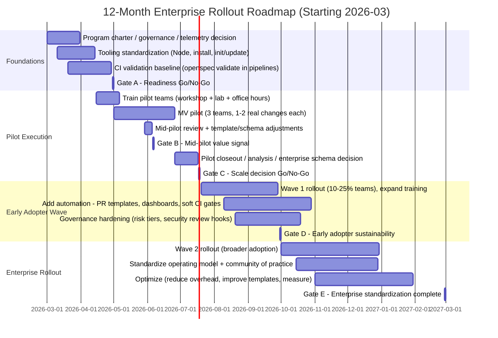
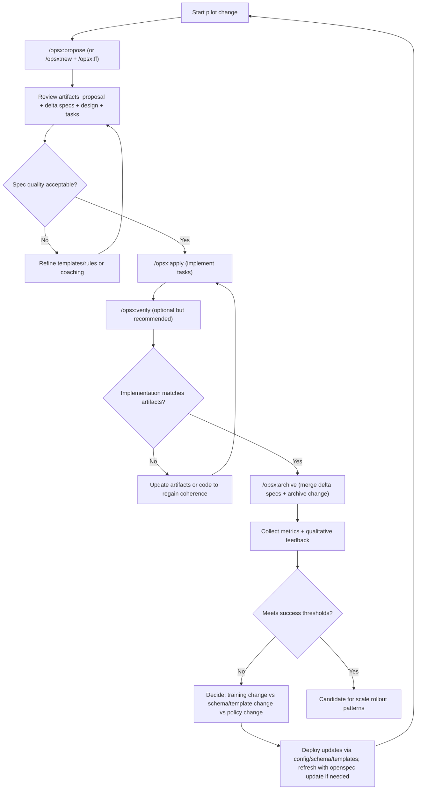

# Evaluating 3–5 Pilot Teams for OpenSpec Spec-Driven Development and Recommended Enterprise Rollout

## Executive summary

Running **3–5 pilot teams** to evaluate OpenSpec for Spec-Driven Development is a **reasonable, evidence-aligned adoption strategy** for an enterprise, provided the pilot is designed to (a) span meaningful variation in product/work types and risk profiles, (b) instrument outcomes with credible baselines, and (c) include an explicit feedback-to-configuration loop rather than treating the pilot as a one-time “tool install.” citeturn15view0turn11view1turn13view0

OpenSpec is explicitly built around an **iterative, “actions not phases” workflow** (proposal/specs/design/tasks/implement) and is intended to be used in **brownfield contexts** (existing codebases) with a separation between **source-of-truth specs** and **proposed change folders**. That architectural separation is useful for pilots because it makes pilot artifacts auditable and comparable across teams, while allowing controlled experimentation via templates/schemas rather than code changes. citeturn3view0turn5view0turn14view2

A **recommended minimum viable pilot** is: **3 pilot teams**, **8 weeks of execution** (plus 2–3 weeks of setup and closeout), each delivering **1–2 production-grade changes** using OpenSpec artifacts as part of normal PR review. Success should be assessed using a combination of **DORA software delivery performance metrics**, team-level “rework” and defect signals, and structured qualitative feedback about collaboration and review burden. citeturn6search1turn0search2turn5view1turn15view0

A pragmatic **12-month rollout** should be gated in waves: (1) foundations and pilot readiness, (2) pilot execution and evaluation, (3) early adopter expansion with hardened governance and automation, and (4) enterprise standardization with ongoing optimization. This sequencing matches what enterprise SDD adoption literature emphasizes: integration with existing workflows, progressive enablement, and avoiding “SpecFall”/documentation bloat by treating SDD as socio-technical change, not a purely technical rollout. citeturn15view0turn8view0turn5view1

## Evidence and rationale for doing 3–5 pilots

OpenSpec’s core workflow is designed to “agree before you build,” organizing work into a per-change folder containing artifacts (proposal, delta specs, design, tasks) and then archiving the change by merging its delta specs into the main specs—creating an audit trail of intent and evolution. citeturn3view0turn13view0

OpenSpec’s “OPSX” approach is explicitly meant to make workflows **hackable and testable** by moving instructions out of hardcoded logic into schemas/templates that teams can modify and validate quickly (“instant effect” when changing templates, rather than waiting on releases). That design strongly supports running multiple pilots in parallel because teams can explore different “enterprise fit” adaptations without forking the tool. citeturn14view2turn5view2

Independent, high-quality sources describing SDD in practice highlight why *multiple* pilots are materially better than a single-team trial:

- entity["company","Microsoft","technology company"]’s write-up of spec-driven development frames it as making technical decisions explicit, reviewable, and evolvable—“version control for your thinking”—and stresses how misaligned assumptions emerge when “shared context” is missing. That’s a cross-team problem; it should be piloted across different team structures and work types. citeturn11view0  
- entity["organization","InfoQ","software engineering media"]’s enterprise adoption analysis argues SDD adoption is not just a tool rollout: it needs workflow integration, progressive enablement, and attention to cultural dynamics (including the risk of “SpecFall” and “markdown monster” outcomes if specs become bureaucratic artifacts). That implies you should pilot with enough diversity to see where those failure modes appear. citeturn15view0  
- entity["organization","DORA","devops research group"]-aligned guidance emphasizes fast feedback and automation + peer review (rather than heavy, late-phase approvals) and provides standardized performance measurements (DORA metrics) suited to comparing outcomes across multiple teams. citeturn0search2turn6search1  
- entity["organization","IETF","internet standards body"] requirements-language guidance (RFC 2119) underpins OpenSpec’s use of MUST/SHALL/SHOULD-style keywords; this matters operationally because consistent normative language improves reviewability and test derivation, and reviewers will vary across teams—another argument for piloting across multiple groups. citeturn5view1turn6search0  

Why **3–5** specifically is a good enterprise starting range:

- It is large enough to cover meaningful variation: at minimum, a customer-facing product team, a backend/API team, and an internal platform/ops team (or equivalent). This aligns with enterprise SDD concerns around developer-centric tooling, cross-stakeholder collaboration, and workflow integration gaps that typically appear only when you span contexts. citeturn15view0  
- It remains operationally manageable for a small enablement group to support with training, instrumentation, and governance while still enabling comparative learning. OpenSpec itself emphasizes being lightweight and scalable across contexts, but that promise should be validated in your environment before wide rollout. citeturn13view0turn5view0  
- Tool evaluation is “time-consuming” and requires trying different problem sizes and greenfield/brownfield contexts to reach realistic conclusions; multiple teams provide parallel evidence faster than serial trials. citeturn11view1  

## Recommended minimum viable pilot design

### Pilot goals and hypotheses

The pilot should be framed as testing **specific, falsifiable hypotheses**, not just “try it and see.” OpenSpec’s artifacts and validation commands make this practical because you can measure both workflow outputs (artifact quality) and downstream outcomes (review friction, rework, defects). citeturn3view0turn5view3

Recommended hypotheses (adapt to your org’s priorities):

- **H1 (alignment):** For medium-sized changes, OpenSpec will reduce “requirements churn” (late scope shifts and rework) by making intent explicit in proposal/specs before implementation. citeturn13view0turn11view0  
- **H2 (review efficiency):** PRs with linked OpenSpec artifacts will reduce review cycles and time-to-merge by improving shared context and traceability. citeturn11view0turn15view0  
- **H3 (quality & risk):** For higher-risk changes, the “spec + scenarios” structure will increase test coverage and reduce post-release defects by making acceptance scenarios explicit and verifiable. citeturn5view1turn0search2turn6search1  
- **H4 (enterprise fit):** OpenSpec’s customization mechanisms (project config + schemas/templates) will be sufficient to adapt the workflow to enterprise governance without forking the core tool. citeturn5view2turn14view2  

### Pilot team selection criteria

To make the pilot evidence credible, selection should be deliberate across these dimensions:

**Roles and collaboration surface**  
Each pilot “team” should be treated as a *delivery unit*, not just developers using a CLI. The minimum set of pilot participants for each team should include:
- A delivery owner (PM, PO, EM, or equivalent) to ensure OpenSpec artifacts capture “why/what” and are reviewed as part of normal planning. citeturn3view0turn11view0  
- A senior engineer/tech lead accountable for ensuring designs and tasks remain implementable and integrating specs into PR review norms. citeturn5view1turn15view0  
- At least one “skeptical reviewer” (often a staff engineer, QA lead, or security champion) to stress-test whether artifacts actually reduce ambiguity. citeturn15view0turn0search2  

**Skill levels (AI + engineering)**  
Include heterogeneity:
- At least one team with strong AI-assisted development experience (to explore upper bound value).
- At least one team with moderate/low AI-assisted development experience (to validate onboarding friction and guardrail needs). OpenSpec explicitly provides onboarding and “guided walkthrough” capabilities; these should be tested with less-experienced users. citeturn4view1turn14view2  

**Product/work types**  
Select teams so the pilot covers at least three of these:
- Customer-facing experience (UI flows, feature flags, UX changes).
- API/service behavior changes (contracts, auth, error handling).
- Data/analytics pipeline or batch workflows.
- Platform/infrastructure automation (CI/CD, deployment scripts, observability).
OpenSpec’s spec organization patterns explicitly anticipate different decompositions (by feature area, component, bounded context), so pilots should validate which decomposition style works in your org. citeturn5view1turn3view0  

**Risk profiles**  
Use a risk-balanced portfolio:
- **Low-risk**: internal tool or non-critical feature to validate baseline workflow adoption speed.
- **Medium-risk**: normal customer-facing or revenue-adjacent improvements.
- **High-governance/high-risk (but scoped)**: security/privacy-sensitive or compliance-touched change, constrained to an achievable slice so you can validate governance integration without overwhelming the pilot.
OpenSpec explicitly recommends “progressive rigor” (lite vs full spec) and suggests full spec rigor for higher-risk contexts like security/privacy or cross-team changes; that principle should directly shape pilot selection. citeturn5view1turn15view0  

### Pilot scope and duration

A minimum viable pilot should aim for **“real work”** outcomes while keeping scope constrained enough to finish.

**Recommended duration**  
- **Weeks 0–2 (setup & baseline):** tooling readiness, baseline metrics capture, training, team charters. citeturn6search1turn14view1turn5view3  
- **Weeks 3–10 (execution):** 2–4 sprints depending on your cadence, each team delivers 1–2 meaningful changes end-to-end. citeturn3view0turn4view0  
- **Weeks 11–12 (analysis & decision):** consolidate findings, decide on enterprise schema/templates, finalize go/no-go. citeturn14view2turn5view2  

**Scope rules**  
- Require each team to run at least one change through **propose → apply → archive** so the archive/merge behavior and audit trail are exercised. citeturn3view0turn13view0  
- Aim for changes that are “small-to-medium” in engineering terms (multi-file, requires tests, requires review), because evaluating SDD tools on tiny tasks can be misleading (either overkill or artificially easy). citeturn11view1turn15view0  
- Enforce “one logical unit of work per change” (a stated OpenSpec best practice) to prevent pilots from failing due to oversized, vague scopes. citeturn4view0  

### Onboarding and training materials

A pilot will fail if it relies on ad-hoc tribal knowledge; training should be intentionally multi-format and role-aware.

**Core materials (minimum set)**  
- A 2-page internal quickstart built around the default path: `/opsx:propose → /opsx:apply → /opsx:archive`. citeturn3view0turn13view0  
- A “what good looks like” artifact pack: example proposal/specs/design/tasks with review comments (based on OpenSpec’s artifact definitions and delta spec format). citeturn3view0turn5view1  
- A short rubric for spec quality (see Metrics section); align it with OpenSpec’s “spec is a behavior contract, not an implementation plan.” citeturn5view1  
- A lightweight “rules of engagement” doc: when to use lite vs full spec, what not to put into specs (secrets, internal-only sensitive data), and how to link artifacts to PRs. citeturn5view1turn7search1  

**Delivery formats (recommended for enterprises)**  
- 60-minute live workshop (recorded): concepts + demo + Q&A. citeturn13view0turn11view0  
- 2-hour hands-on lab: participants produce one change folder and run validation. OpenSpec’s guided onboarding command (`/opsx:onboard`) is specifically designed for walking through an end-to-end change and should be used as the lab backbone. citeturn4view1turn14view2  
- Weekly office hours during execution (30–45 min), focused on reviewing real artifacts and removing friction. This supports the “dialogue” and socio-technical nature of SDD emphasized in enterprise adoption guidance. citeturn15view0  

### Required tooling and infrastructure for the pilot

OpenSpec’s operational prerequisites are modest but not zero:

- **Node.js 20.19.0+** is required to run the CLI, and you’ll need an enterprise-supported install path (developer machines, devcontainers, build images, or internal package management). citeturn13view0turn14view1  
- OpenSpec is installed globally (or via Nix) and then initialized per repo (`openspec init`), with updates applied via `openspec update` to refresh agent instructions. citeturn13view0turn5view4  
- The pilot should include CI validation of specs using `openspec validate` (optionally strict) to ensure formatting and structural correctness stays consistent across teams; the CLI supports JSON output suitable for automation. citeturn5view3turn5view4  
- Tool integration varies by assistant; OpenSpec can generate tool-specific skills/command files and documents expected paths for many assistants (including GitHub Copilot prompt paths). The pilot should standardize on 1–2 assistants if possible to reduce confounding variation, while still validating portability. citeturn14view0turn13view0  

### Estimated resource needs for the minimum viable pilot

Because org size is unknown, resource needs are expressed as a blend of **central enablement** and **per-team commitments**.

- Central enablement: 1 pilot lead (0.3–0.5 FTE for ~12 weeks), 1 toolchain/DevEx engineer (0.2–0.4 FTE), 1 security partner (0.1–0.2 FTE), 1 data/metrics analyst (0.1–0.2 FTE). The SSDF explicitly calls out the importance of prepared people/processes/technology and role-based training, which is functionally what this enablement set provides. citeturn8view0turn10view0  
- Per team: one “pilot champion” (often the tech lead) spending ~2–4 hours/week on artifact review discipline and feedback collection; each change also requires some incremental planning/review time because specs are new work. The pilot must measure whether that overhead is offset by reduced rework and faster alignment. citeturn11view0turn15view0  

### Comparison of three pilot configurations

| Pilot configuration | Teams (within 3–5) | Duration (execution) | Expected learning outcomes | Expected delivery outcomes | Enablement load |
|---|---:|---:|---|---|---|
| Small | 3 teams | 8 weeks | Clear signal on baseline adoption friction; validates core workflow and spec quality rubric | 3–6 completed changes archived and merged into source-of-truth specs | Moderate; manageable with a small enablement group |
| Medium | 4 teams | 10 weeks | Adds one specialized context (e.g., platform or regulated domain) and increases confidence in portability | 4–8 completed changes; enough volume to see repeat patterns and schema needs | Higher; more variance to support, stronger need for office hours |
| Large | 5 teams | 12 weeks | Best coverage of product types + risk profiles; strongest data for enterprise policy decisions | 5–10+ completed changes; better evidence for rollout sequencing and governance integration | Significant; requires robust metrics automation and explicit change management |

This comparison is grounded in the practical reality that SDD tool evaluation is inherently context-sensitive and time-consuming, and enterprise adoption requires progressive enablement plus integration with existing workflows; increasing the number of teams increases evidence quality but also increases enablement burden and coordination risk. citeturn11view1turn15view0

**Recommendation:** Start with the **Small (3-team)** configuration unless you already have a mature internal developer enablement function and strong metrics automation; add a fourth/fifth team only if you can keep the pilot supported and instrumented. citeturn8view0turn6search1

## Metrics, data collection, and evaluation decision gates

### Success metrics

A credible pilot should use a **balanced scorecard**: software delivery performance + product outcomes + quality + human factors.

**Quantitative metrics (recommended minimum set)**  
- **DORA metrics (team-level trends):** deployment frequency, change lead time, time to restore service / failed deployment recovery time, and change failure rate. Use these primarily for trend and context, not cross-team “league tables,” and compare against each team’s baseline. citeturn6search1turn6search5turn6search33  
- **Spec-to-merge cycle time:** time from `/opsx:propose` (or equivalent) to PR merged; also measure time from tasks finalized to merge to separate planning vs implementation. OpenSpec’s lifecycle structure makes these timestamps observable. citeturn3view0turn4view1  
- **Rework rate proxy:** number of PR re-openings, number of “scope change” commits after review, or issue churn (tickets reopened, acceptance criteria modified late). This directly evaluates the “shared context” hypothesis. citeturn11view0turn15view0  
- **Quality signals:** escaped defects count per change, test additions per change, and security findings in pipeline (SAST/secret scan/dependency scan). NIST SSDF emphasizes outcome-based secure practices and toolchain integration; your existing security tooling should be included in the measurement, not bypassed for the pilot. citeturn8view0turn0search2turn7search1  

**Qualitative metrics (required, not optional)**  
- “Was the spec actually used during review and development, or was it ceremonial?” This is the heart of preventing “SpecFall.” citeturn15view0  
- Developer and reviewer sentiment: perceived clarity, perceived overhead, perceived reduction in back-and-forth. citeturn11view0  
- Cross-functional collaboration quality: did PM/QA/security input happen earlier and more cleanly? Enterprise SDD guidance emphasizes the bigger impact is cultural and collaborative. citeturn15view0  

### Data collection methods

- **Automated extraction (preferred):** derive cycle time and PR signals from your code host; derive DORA metrics from CI/CD and incident tooling; run `openspec validate --all --json` in CI to capture spec health and structural issues. citeturn5view4turn6search1turn0search2  
- **Artifact quality sampling:** weekly review of a subset of changes using a rubric aligned to OpenSpec’s “behavior contract” guidance. citeturn5view1turn3view0  
- **Structured interviews:** 30-minute interviews with each team’s champion and 2–3 reviewers at mid-pilot and post-pilot; this is critical because SDD adoption dynamics are not fully captured by throughput metrics. citeturn15view0  
- **Short pulse surveys:** weekly (2–3 questions) and end-of-pilot (10–15 questions) to reduce recall bias. citeturn6search3  

### Decision gates and go/no-go criteria

A well-run pilot should have explicit gates; otherwise you risk drifting into “permanent pilot.”

**Gate A: Readiness (end of setup, ~Week 2)**  
Go if:
- Tooling works end-to-end: install, init, commands recognized in chosen assistant(s), validation works in CI. citeturn13view0turn14view0turn5view4  
- Security stance approved for pilot scope (data classifications, telemetry posture, assistant usage). citeturn13view0turn7search1turn8view0  

No-go (pause) if:
- Your AI assistant environment cannot meet baseline policy requirements (e.g., prompt handling, retention, or access controls are unknown). citeturn7search1turn7search6  

**Gate B: Mid-pilot value signal (midpoint, ~Week 6)**  
Go if:
- At least 60–70% of pilot changes show “spec used in review” evidence (review comments refer to specs/scenarios; tasks reflect agreed scope). citeturn11view0turn15view0  
- Teams can produce “lite specs” without major friction, consistent with OpenSpec’s progressive rigor approach. citeturn5view1  

No-go (reset scope/training) if:
- Most specs are either (a) too implementation-heavy or (b) too vague to be testable, violating OpenSpec’s definition of spec content. citeturn5view1  

**Gate C: Pilot completion and scale decision (post execution, ~Week 10–12)**  
Go if (recommended minimum):
- 2 of 3 pilot teams show improvement in at least one of: cycle time, reduced rework proxy, or reduced review iterations, *without* worsening quality signals. citeturn6search1turn0search2  
- Qualitative feedback indicates net-positive alignment and acceptable overhead (or overhead is front-loaded but trending down as fluency increases). citeturn6search3turn15view0  
- You have a clear “enterprise schema” decision: either adopt core profile with lightweight guidance, or fork schema/templates to encode your governance needs. citeturn5view2turn14view2  

No-go if:
- The organization treats specs as documentation theater (low usage during real work) or the pilot produces “markdown monster” artifacts with low maintenance intent. citeturn15view0  

## Tooling, governance, security, and change management

### Tooling/infrastructure needs at enterprise quality

Beyond the pilot, you should plan for:

- Standardized developer environment support (Node version management, devcontainers, internal mirrors if needed). citeturn13view0turn14view1  
- CI automation: `openspec validate` as a quality gate (initially warning-only; later fail-on-strict for selected repos). The CLI supports strict validation and concurrency tuning, making it reasonable to run at scale. citeturn5view4  
- “Definition of done” integration: PR template updates to include links to the relevant OpenSpec change folder and confirmation that specs were updated/archived. This aligns with the DORA guidance that approvals should occur via peer review and automation early, not as late, heavyweight gates. citeturn0search2turn3view0  

### Governance and security considerations

OpenSpec-specific considerations you must address:

- **Telemetry:** OpenSpec collects anonymous usage stats (command names and version only), is disabled in CI, and can be opted out via environment variables. Enterprises should decide whether telemetry is allowed and document the standard posture. citeturn13view0  
- **Artifact sensitivity:** Specs/proposals can contain business logic, system behavior, and sometimes sensitive operational constraints. Treat OpenSpec directories as first-class assets subject to your data classification and repo access controls. citeturn3view0turn7search6  

AI assistant security considerations are broader than OpenSpec but become more important when adopting SDD because specs increase the volume of structured “intent” data:

- entity["organization","OWASP","web security nonprofit"]’s Top 10 for LLM Applications highlights risks directly relevant to AI-assisted development workflows, including prompt injection and insecure output handling—both of which argue for strong boundaries on what data goes into prompts/specs and for robust validation of AI-generated code before merging. citeturn7search1  
- entity["organization","National Institute of Standards and Technology","us standards agency"]’s SSDF emphasizes preparing the organization, secure toolchains, and role-based training; it explicitly frames artifacts as “evidence” and records of secure practices—an important lens for treating OpenSpec artifacts as audit-friendly engineering outputs rather than optional documentation. citeturn8view0turn10view1  
- NIST’s AI Risk Management Framework positioning emphasizes managing AI risks to improve trustworthiness and is a strong fit for establishing governance around enterprise AI coding assistants (risk identification, measurement, monitoring). citeturn7search6  

Vendor-specific data handling varies; as an example, entity["company","GitHub","developer platform"]’s Copilot Trust Center FAQ indicates Copilot Business/Enterprise customers’ code and queries are not retained for training purposes, but other documentation highlights that retention can vary by access mode and telemetry types; enterprises should validate the exact modes they intend to use. citeturn7search15turn7search17  

### Change management and stakeholder communication

SDD adoption changes “how work enters the system,” so you should treat it as a change program, not a developer-only experiment.

A pragmatic communication model is to use entity["company","Prosci","change management firm"]’s ADKAR framing (awareness, desire, knowledge, ability, reinforcement) to ensure you cover executive sponsorship, hands-on enablement, and durable reinforcement via templates and workflow expectations. citeturn6search3turn6search15

Recommended stakeholder messaging (high-level):
- Executives: improved predictability and reduced rework via explicit intent and reviewable artifacts. citeturn11view0turn15view0  
- Product and QA: specs as a shared collaboration interface, not just engineering documentation. citeturn15view0turn3view0  
- Security and compliance: tighter traceability from intent → design → tasks → code, and better evidence via artifacts and validation gates. citeturn10view1turn8view0turn5view4  

## 12-month enterprise rollout roadmap, decision gates, and artifacts

### Rollout phasing and milestones

This roadmap assumes you finish the pilot by late spring 2026 and scale through early 2027; adjust to your fiscal/calendar reality. The sequencing reflects enterprise SDD guidance that emphasizes progressive enablement, workflow integration, and avoiding spec bureaucracy. citeturn15view0turn14view2

**Phase 1: Foundations and readiness (Months 0–2)**  
Milestones:
- Define enterprise pilot charter(s), success metrics, and security posture (including telemetry decision). citeturn13view0turn8view0  
- Standardize installation path and baseline CI validation approach. citeturn14view1turn5view4  
Decision gate (Go/No-Go):
- Go if tool + assistant(s) work reliably and security signoff exists for the pilot scope. citeturn14view0turn7search1  

**Phase 2: Execute pilots and iterate templates (Months 2–5)**  
Milestones:
- Run 3-team MV pilot; collect weekly data; hold office hours; start a shared “schema/template backlog.” citeturn15view0turn14view2  
Decision gate:
- Go if pilot shows credible value signal and teams can produce maintainable specs (no “markdown monster”). citeturn15view0turn5view1  

**Phase 3: Early adopter wave and standardization (Months 5–9)**  
Milestones:
- Expand to 10–25% of engineering teams (or an equivalent “wave” scaled to your org), using an enterprise schema and standardized training with role-aware modules.
- Introduce CI gates (soft → hard) for spec validation in selected repos. citeturn5view4turn8view0  
Decision gate:
- Go if adoption is sustained (not just novelty), measurable outcomes remain stable/improving, and governance is not creating late-phase friction. citeturn0search2turn6search1  

**Phase 4: Enterprise rollout and continuous improvement (Months 9–12)**  
Milestones:
- Publish enterprise SDD “operating model”: templates, review norms, data dashboards, and ownership for ongoing policy/schema changes.
- Establish a standing review board for schema/template updates (lightweight, fast), aligned with OpenSpec’s model of rapid iteration via templates rather than tool forks. citeturn14view2turn5view2  
Decision gate:
- Go if the method is sustainable with normal staffing and if security posture is demonstrably maintained. citeturn8view0turn7search6  

### Mermaid timeline for the 12-month rollout

### Mermaid flowchart for the pilot feedback loop

### Suggested templates

#### Pilot charter template

**Pilot name:**  
**Pilot sponsor:**  
**Enablement lead:**  
**Security partner:**  
**Participating teams (3–5):**  

**Objective**  
Describe the business/engineering objective (e.g., reduce rework, improve review clarity, improve predictability for AI-assisted changes). citeturn11view0turn15view0  

**Scope**  
- In scope: define the types of changes (size, domains) and required OpenSpec lifecycle (propose/apply/archive). citeturn3view0turn4view1  
- Out of scope: define excluded work (e.g., emergency hotfixes, major migrations) unless intentionally piloted. citeturn5view1  

**Success metrics**  
- Quantitative: list the chosen DORA + cycle-time + rework + quality measures. citeturn6search1turn0search2  
- Qualitative: list collaboration/review satisfaction and “spec used in practice” signals. citeturn15view0  

**Governance and security**  
- Telemetry stance (allowed/disabled), environment variables if disabled. citeturn13view0  
- Data classification rules for specs/proposals. citeturn7search1turn7search6  
- Required validations (CI scans, openspec validate). citeturn5view4turn8view0  

**Operating cadence**  
- Weekly office hours schedule  
- Artifact review cadence  
- Mid-pilot and end-pilot review dates  

**Decision gates**  
Define Gate A/B/C criteria (readiness, midpoint signal, scale decision). citeturn15view0turn14view2  

**Risks and mitigations**  
List top risks (overhead, spec bloat, security leakage, metrics noise) and mitigations (progressive rigor, rubric, validation automation). citeturn5view1turn7search1turn0search2  

#### Feedback survey template

Use role-targeted variants (Developer, Reviewer, PM/QA/Security). Suggested items:

**Likert-scale (1–5)**  
- The proposal/specs improved clarity of “why/what” before implementation. citeturn11view0  
- The tasks artifact reduced ambiguity about what needed to be built. citeturn3view0  
- Reviews were faster or required fewer iterations because artifacts were available. citeturn11view0turn15view0  
- The process added acceptable overhead relative to the value. citeturn15view0  
- I would recommend using OpenSpec for similar changes. citeturn13view0  

**Open-ended**  
- What was the single biggest friction point? (tooling / workflow / governance / training) citeturn14view2turn8view0  
- Which artifact was most valuable (proposal/specs/design/tasks) and why? citeturn3view0  
- Where did specs become “documentation theater” (if anywhere)? citeturn15view0  
- What should we change first: templates, rules, schema, or policy? citeturn5view2turn14view2  

**Optional: risk & security prompts**  
- Did you ever feel pressure to include sensitive data in specs/prompts to make the AI succeed? If yes, what kind? citeturn7search1turn7search6  

Do you want me to create a markdown file of my response?