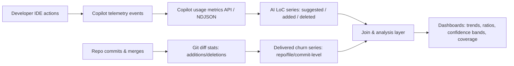
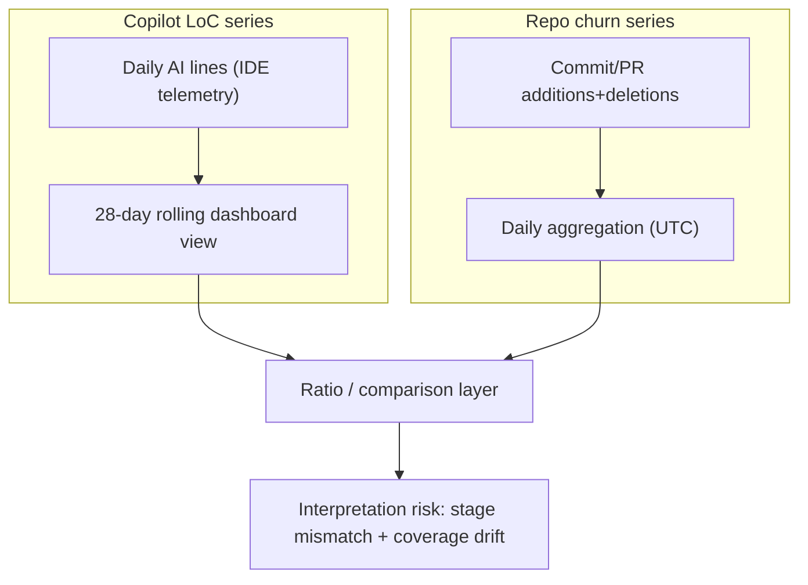

# Measuring AI-Written Code Over Time Using GitHub Copilot Line Metrics vs Git Line Churn

## Executive summary

GitHub Copilot’s “AI lines added/deleted” (Lines of Code, or LoC) metrics are explicitly designed as a **directional measure of Copilot output**—quantifying lines “suggested, added, or deleted” across completions, chat, and agent features. citeturn27search8turn6view0 This makes them well-suited for tracking **Copilot-enabled editing volume and adoption trends**, especially when you need **daily time series** and breakdowns by IDE, feature, language, and (for some metrics) model. citeturn3view3turn28view0turn28view1

Overall lines added/deleted from version control (“git churn”) are a fundamentally different kind of measurement: they are **repository-history diff statistics** that reflect what was actually committed/merged, and they can be computed per repo/file/commit/developer with highly reproducible methods (e.g., `--numstat`). citeturn13view0 But they do **not** tell you whether code was produced by AI, a human, a template, a formatter, a refactor, or a codegen tool, because diff stats attribute only *text changes*, not authorship source. citeturn13view1

Using “AI lines added/deleted ÷ total lines added/deleted” as “% of code written by AI” is therefore attractive but often **conceptually invalid without careful qualification**. The numerator is typically **IDE-telemetry-based Copilot insertions/edits**, while the denominator is **committed repository churn**—two different stages of the lifecycle, different coverage rules, and different failure modes. citeturn3view3turn28view0turn13view0 In practice, naïve ratios can exceed 100%, shift abruptly due to client version coverage, and be biased by which languages, file types, and workflows a team uses. citeturn2view0turn28view1

A more rigorous approach is to treat Copilot LoC metrics as **“Copilot-touch volume”** (AI-assisted editing activity) and treat repository churn as **“delivered change volume.”** Track them side-by-side, and if you do compute a share metric, label it explicitly as an *approximation* and attach **coverage checks** and **uncertainty bounds** derived from user-level daily telemetry. citeturn28view0turn3view3turn2view0

## Definitions and measurement methods

### What GitHub Copilot “AI lines added/deleted” actually are

Copilot LoC metrics are presented as a “directional measure” of Copilot output and appear in (a) a code generation dashboard and (b) exports/APIs that expose LoC fields such as `loc_suggested_to_add_sum`, `loc_added_sum`, and `loc_deleted_sum`. citeturn3view0turn27search8

Key field definitions from GitHub’s Copilot usage metrics reference include (selected highlights):  
- `loc_suggested_to_add_sum`: lines Copilot **suggested to add** (completions, inline chat, chat panel; **excludes agent edits**). citeturn3view3  
- `loc_added_sum`: lines **actually added to the editor**, including accepted completions, applied code blocks, and agent/edit mode changes. citeturn3view3turn2view0  
- `loc_deleted_sum`: lines deleted from the editor (notably described as “currently from agent edits”). citeturn3view3  
- `code_generation_activity_count`: counts distinct Copilot output events and **includes comments and docstrings**. citeturn3view3  
- `code_acceptance_activity_count`: counts built-in accept actions (apply/insert/copy button), and explicitly **does not count manual OS clipboard actions**. citeturn3view4  

Agent mode is explicitly measured differently because it does not follow a “suggest then accept” flow; agent edits written into files are counted as added/deleted lines under the `agent_edit` feature, and multi-file operations contribute to added/deleted line totals across all edited files. citeturn3view0

### What “overall lines added/deleted” usually mean in Git and Git hosting platforms

In Git-style diffs, “lines added” and “lines deleted” are derived from line-based diff analysis. Git documents that `--numstat` reports “number of added and deleted lines” (and uses `-` for binary files), and it also notes that some diff statistics can underweight pure line rearrangements relative to other change types. citeturn13view0turn13view1

On hosting platforms, similar statistics are available at PR/commit levels (e.g., pull request JSON commonly includes `additions`, `deletions`, and `changed_files`). citeturn22search5

### Why these two measurement systems are easy to confuse

GitHub’s Copilot LoC metrics are **telemetry-derived activity measures** (what happened in an IDE/agent workflow), while “overall lines added/deleted” are typically **repository-history measures** (what ended up in the codebase). These differ by:  
- **Lifecycle stage** (editor activity vs committed change) citeturn3view3turn13view0  
- **Coverage requirements** (telemetry enabled; minimum IDE/plugin versions; processing delays) citeturn2view0turn28view1  
- **Aggregation choices** (Copilot dashboards use a rolling 28‑day window; APIs are daily records) citeturn28view0  

The diagram shows the core methodological risk: if you compute a ratio, you are dividing numbers produced by **different pipelines** unless you explicitly align them.

image_group{"layout":"carousel","aspect_ratio":"16:9","query":["GitHub Copilot code generation dashboard lines of code changed with AI","git diff --numstat output example","GitHub Copilot usage metrics dashboard screenshot"],"num_per_query":1}

## Conceptual validity and attribution accuracy

### The intended concept: “AI-written code”

Teams usually mean one (or more) of the following when they say “AI-written code”:

1) **AI-originated text**: the model produced the initial tokens/lines.  
2) **AI-accepted text**: the developer accepted/inserted Copilot output into an editor.  
3) **AI-delivered code**: AI-originated text that survived editing/review and was committed/merged.  
4) **AI-owned change**: a unit of work whose solution strategy came from AI even if the final code was typed/rewritten by a human.

Copilot LoC metrics are closest to #2 and partially to #1 (via “suggested”), but they do not directly represent #3 (delivered code), and they do not measure #4 (cognitive contribution). citeturn3view3turn27search8turn13view0

### What Copilot LoC metrics capture well

Copilot LoC metrics are strong at capturing **Copilot-mediated insertion volume** in workflows where developers use built-in “accept/apply/insert/copy” actions and agent/edit mode writes changes into files. citeturn3view3turn3view4turn3view0 They also support breakdowns that are often crucial for interpretation (feature buckets, IDEs, language/feature combinations, etc.). citeturn3view3turn28view0

### Systematic false negatives

Copilot LoC metrics (and related acceptance metrics) can undercount AI contribution when:

- **Telemetry is disabled** in the IDE: IDE-based activity will not appear in dashboards/APIs/exports. citeturn28view0  
- Users are on **older IDE/plugin versions** that do not emit the required telemetry; GitHub explicitly warns of underreporting until upgrades and provides version fields to monitor coverage. citeturn2view0turn32search2  
- Developers use **manual clipboard workflows** (e.g., OS copy/paste) rather than built-in accept/copy buttons; GitHub’s acceptance metric explicitly does not count manual OS clipboard actions. citeturn3view4  
- AI assistance happens in **non-included surfaces** (for example, Copilot Chat on GitHub.com or GitHub Mobile is excluded from Copilot usage metrics per GitHub’s description). citeturn32search1turn28view1  
- Developers use **other AI tools** (outside Copilot telemetry), which will not register in Copilot metrics by definition. citeturn28view1  

### Systematic false positives and over-attribution

Copilot LoC metrics can overstate “AI-written” in ways that matter for decision-making:

- **Comments/docstrings** are included in some generation counts; if you interpret LoC as “code,” and a team uses Copilot heavily for documentation, you may inflate “AI code” estimates. citeturn3view3  
- **Agent multi-file edits** can generate substantial added/deleted lines across many files from a single prompt; this is real Copilot activity but can be mistaken for sustained human-level “coding output.” citeturn3view0  
- **Deleted-line coverage is incomplete** for suggestion-based deletion: GitHub notes `loc_suggested_to_delete_sum` is “future support planned,” and `loc_deleted_sum` is currently from agent edits, so “AI deletions” is not symmetric with “AI additions.” citeturn3view3  
- The “directional measure” framing (GitHub’s wording) is a warning that the metric is not meant to be a forensic accounting of authorship. citeturn27search8turn6view0  

### Copied code, templates, and “generated vs suggested”

The licensing and “copied code” question intersects directly with attribution validity:

- GitHub introduced “code referencing” that checks suggestions (with ~150 characters of surrounding code) against an index of public code and can surface matching repositories and licenses in-editor; GitHub has also stated that matches are rare overall but more common in empty/nearly empty files. citeturn11view2  
- GitHub documentation shows that when public code references are generated, logs can include file paths, line/column location, and license identifiers (or `NOASSERTION`). citeturn11view3  
- Academic work shows that code-generation LMs can leak memorized or sensitive data: one study on GitHub Copilot’s underlying model context reports privacy-leak findings in generated outputs, and broader research on code-model memorization highlights risks including “code with strict licenses.” citeturn30view0turn30view1  
- Research also cautions that filters intended to prevent verbatim memorization can be bypassed in some settings (i.e., “false sense of privacy” risks). citeturn30view3  

These points matter because a high “AI lines added” number could reflect: legitimate novel synthesis, boilerplate scaffolding, templated code patterns, or near-matches to public code with licensing obligations—with very different risk profiles. citeturn11view2turn11view0turn30view1

## Granularity, coverage, and comparison pitfalls

### Granularity: what you can and cannot measure natively

GitHub’s Copilot usage metrics architecture is primarily optimized for **enterprise/org/user** analysis, not repo/file/commit attribution:

- GitHub describes Copilot usage metrics APIs as providing data at **enterprise, organization, and user** levels, with dashboards at enterprise/org scope. citeturn28view1turn28view0  
- The reporting model differs by surface: dashboards are a **rolling 28-day window**, while APIs/NDJSON provide **daily records**. citeturn28view0turn5view2  
- Organization attribution is explicitly based on **organization membership**, not “where actions occur,” and GitHub warns that org-level analytics are not designed to be compared directly to enterprise totals due to this attribution model. citeturn28view1  

By contrast, git churn can be computed naturally at: per repo, per file/path, per commit, per PR, per author identity, and aggregated over arbitrary windows—because the unit is derived from diffs in the repo history. citeturn13view0turn22search5

**Implication:** if the business question is “which repositories are becoming AI-heavy,” Copilot LoC metrics alone will often be insufficient without additional instrumentation (tagging, repository-level joins, or other telemetry). citeturn28view1turn28view0

### Coverage pitfalls that distort time series

Copilot LoC and usage metrics are sensitive to:

- **Minimum IDE/plugin versions**; GitHub warns that profiles on older versions won’t contribute LoC telemetry, causing underreporting until upgrades. citeturn2view0turn28view1  
- **Telemetry definition changes**; GitHub explicitly warns that as Copilot evolves, telemetry definitions may change and you should “expect small shifts.” citeturn2view0turn32search2  
- **Data processing lag**; GitHub indicates data is typically available within two full UTC days after a day closes, which affects near-real-time dashboards and change-point analysis. citeturn28view1  

Git churn statistics have their own pitfalls (for example, autoformatting, large renames, generated file churn), but their coverage does not depend on IDE plugin versions.

### The “denominator mismatch” problem in AI share ratios

If you compute:

\[
\text{AI-share}_t = \frac{\text{Copilot } loc\_added\_sum_t + \text{Copilot } loc\_deleted\_sum_t}{\text{Repo additions}_t + \text{Repo deletions}_t}
\]

You are mixing:

- Numerator: editor-level Copilot-mediated changes (with partial deletion coverage and coverage constraints). citeturn3view3turn2view0  
- Denominator: committed repo diffs, sensitive to PR policies, rebases, squashes, generated files, and refactors. citeturn13view0turn22search5  

This can produce misleading dynamics:
- **AI-share > 1** when Copilot-generated edits occur in scratch branches, unstable files, or are later reverted before merging. (This follows from stage mismatch.) citeturn3view3turn13view0  
- **Artificial drops** when a repo has a reformat/refactor week (huge git churn) even if Copilot use is constant. citeturn13view1  
- **Artificial jumps** when a large share of developers upgrade IDE plugins enabling LoC telemetry, increasing the numerator without corresponding workflow change. citeturn2view0turn32search2  

### Practical comparison table

| Dimension | Copilot “AI lines added/deleted” (LoC telemetry) | Overall lines added/deleted (git/PR diff churn) |
|---|---|---|
| Primary meaning | Directional Copilot output volume: lines suggested/added/deleted in IDE workflows citeturn27search8turn3view3 | Text churn between two repo states (commits/PRs), not authorship citeturn13view0turn13view1 |
| Lifecycle stage | Editor/agent activity (pre-commit possible) citeturn3view3turn3view0 | Committed/merged history (post-review policies apply) citeturn13view0turn22search5 |
| Granularity | Enterprise/org/user daily; breakdowns by feature, IDE, language; not inherently per repo/file | Per repo/file/commit/PR/author feasible (but depends on identity mapping) citeturn13view0turn22search5 |
| Coverage risks | Requires telemetry enabled + supported IDE/plugin versions; definitions can shift citeturn28view0turn2view0 | Driven by repo history; sensitive to refactors/formatting; large repos may hit API limitations if using certain endpoints citeturn13view2 |
| Attribution | Measures “Copilot-touched” lines, not “AI-delivered” lines; misses some workflows (manual clipboard) citeturn3view4turn3view3 | No intrinsic AI attribution; includes all churn sources (humans, generators, formatters) citeturn13view1 |
| Best use | Adoption, enablement, AI-assist activity analysis and segmentation citeturn28view2turn28view0 | Delivery/composition analysis, repo governance, batch size, refactor detection (with care) citeturn13view0turn13view1 |

## Incentives, privacy/licensing, and manipulation risks

### Incentives and behavioral effects

Any time a metric becomes a target, it risks distorting behavior (e.g., optimizing for “more accepted lines” rather than better outcomes). This is the core dynamic described by entity["people","Charles Goodhart","economist"]’s “Goodhart’s law,” and is also closely related to entity["people","Donald T. Campbell","social scientist"]’s warning that quantitative indicators used for decision-making become subject to “corruption pressures,” often distorting the process they were meant to monitor. citeturn33view0

In a Copilot-LoC context, predictable second-order effects include:
- Favoring workflows that “count” (built-in accept/apply actions) over equally productive workflows that don’t (manual copy/paste), which changes the metric without necessarily changing AI reliance. citeturn3view4  
- Incentivizing large agent-driven refactors to inflate “AI lines,” even when architectural changes should be smaller and safer. citeturn3view0  
- Nudging developers toward “AI-visible” code generation rather than “AI-invisible” planning, review, or debugging work, despite GitHub framing these dashboards mainly for adoption and trend visibility rather than definitive impact measurement. citeturn6view0turn28view2  

### Privacy and data governance

GitHub’s terms for Copilot state that Copilot may collect and process Prompts, Suggestions, code snippets, and additional usage information tied to an account; they also note that data may be shared with third-party applications or third-party AI models under user instruction, and that this may include personal data as referenced in the GitHub Privacy Statement. citeturn11view0

Copilot usage metrics data can include user-level identifiers such as `user_id` and `user_login`, which makes the raw feeds sensitive and often subject to internal privacy controls. citeturn3view3 GitHub further notes that tracked events can come from both client- and server-side telemetry (for durability), and that some IDE telemetry may be inconsistent in certain third-party IDEs. citeturn12view4

For longitudinal analysis, governance and retention matter:
- Usage metrics API endpoints return report download links for daily and 28-day reports, and GitHub notes availability constraints (e.g., historical access “for up to 1 year”). citeturn5view2  
- Some activity properties (like `last_activity_at`) are retained for a rolling 90 days and can become `nil` after inactivity, impacting long-term user-level analyses if you rely on that field as a baseline. citeturn12view4  

### Licensing and legal implications

GitHub’s Copilot terms emphasize that GitHub does not own “Suggestions,” users retain ownership of their code, and users retain responsibility for Suggestions they include in their code. GitHub also notes that if you allow “Suggestions matching public code,” you must comply with cited licenses. citeturn11view0

Code referencing explicitly surfaces matches and license context when suggestions match publicly available code, and documentation shows that the surfaced references can include repository links and license identifiers (or lack thereof). citeturn11view2turn11view3 Academic research reinforces that memorization/regurgitation risks exist for code models, including risks involving sensitive information and licensed content. citeturn30view0turn30view1turn30view3

**Metric-specific legal risk:** If an organization uses “% AI-written code” as a compliance, contractual, or public-facing claim, the measurement ambiguity (stage mismatch, incomplete coverage, comments/docstrings inclusion, deletion asymmetry) can create audit and misrepresentation risk unless the organization clearly defines its construct and method. citeturn3view3turn2view0turn27search8

## Statistical methods for trends, uncertainty, and recommended visualizations

### Data alignment and preprocessing

GitHub advises that dashboards and APIs use shared metric definitions but differ in windows: dashboards are rolling 28 days, while APIs/NDJSON are daily, enabling daily trend analysis. citeturn28view0 Copilot usage data is typically available within two full UTC days after the day closes, which implies that trend pipelines should lag or backfill accordingly. citeturn28view1

Recommended preprocessing steps for Copilot LoC + repo churn comparisons:
- Normalize time to **UTC calendar days** (since Copilot processing is described in UTC-day terms and lags). citeturn28view1turn28view0  
- Track **coverage indicators** explicitly, using available version fields to detect when LoC telemetry is ramping due to upgrades. citeturn2view0  
- Separate **added vs deleted** rather than only net, because deletion coverage is currently asymmetric (notably “deleted” is currently from agent edits). citeturn3view3  

### Trend analysis approaches

Because the data is count-like and often heavy-tailed (occasionally huge agent edits or refactors), robust methods tend to work better than raw daily plots:

- **Rolling medians / robust smoothing** (7-day or 14-day) for daily series to reduce noise; compare to GitHub’s own use of rolling windows in dashboards. citeturn28view0  
- **Change-point detection** to identify “step changes” around IDE/plugin rollouts (coverage-driven jumps) vs organic adoption. GitHub explicitly warns small shifts can occur as telemetry definitions evolve. citeturn2view0  
- **Decomposition** (e.g., weekly seasonality + trend) for organizations with business-week patterns; daily records support this. citeturn28view0  

### Uncertainty quantification: making “AI share” less misleading

If you still want an AI-share metric, you can quantify uncertainty using the fact that GitHub provides **user-level daily records** via APIs/exports. citeturn5view2turn3view3 Practical approaches:

- **Bootstrap across developers (daily)**: resample users within a day to compute a confidence interval for mean AI lines per active user, then propagate to a ratio (with denominators from repo churn). This captures variability in usage intensity and avoids over-interpreting single-day spikes. citeturn28view0turn3view3  
- **Hierarchical models** (Bayesian or mixed-effects): model AI lines as a function of team, language mix, IDE, enabling partial pooling and more stable trend estimates when daily counts are sparse. The availability of breakdowns by language/feature supports this kind of modeling. citeturn3view3turn28view0  
- **Coverage-adjusted estimates**: weight AI-line totals by the estimated fraction of active-seat developers who are (a) on supported versions and (b) telemetry-enabled, to reduce bias when coverage changes over time. GitHub explicitly calls out coverage limitations and provides version fields to monitor it. citeturn2view0turn28view0  

### Visualization recommendations

To avoid misleading conclusions, prefer a **multi-panel dashboard** rather than a single ratio:

1) **Copilot LoC activity over time**: stacked lines (added vs deleted) plus a net line; annotate major rollouts (IDE/plugin upgrades). citeturn2view0turn3view3  
2) **Repo churn over time**: additions/deletions from git/PR stats; optionally filtered to exclude generated/lock/vendor files to reduce noise (methodological choice; diff semantics still apply). citeturn13view0turn13view1  
3) **Adoption context**: daily active users and acceptance rate (acceptance ÷ generation) using GitHub’s aligned definitions. citeturn28view0turn28view2  
4) **Breakdowns**: heatmaps of AI lines by language and feature (useful to distinguish “AI used for tests/docs scaffolding” vs production languages). citeturn3view3turn6view1  
5) If you must show a ratio: display **(a) ratio**, **(b) confidence band**, and **(c) coverage overlay** (e.g., % of active users on LoC-capable plugin versions). citeturn2view0turn28view0  

## Best-practice recommendations for teams implementing this metric

### Use precise naming and definitions

Treat the Copilot LoC series as **Copilot-touch line volume** (or “AI-assisted edits”) rather than “AI-written code,” unless you have a defensible methodology to link Copilot insertions to merged code. GitHub itself frames LoC as a directional measure of Copilot output. citeturn27search8turn6view0

A practical taxonomy that reduces confusion:
- **AI suggested**: `loc_suggested_to_add_sum` (what Copilot proposed) citeturn3view3  
- **AI inserted/edited in IDE**: `loc_added_sum`/`loc_deleted_sum` (what entered the editor through Copilot-mediated actions) citeturn3view3turn3view0  
- **AI delivered**: subset of inserted lines that survive to merge (must be measured via a join strategy, not Copilot LoC alone) citeturn13view0turn3view3  

### Establish minimum thresholds before publishing trends

Because GitHub warns that LoC telemetry coverage depends on IDE/plugin versions and that metrics may shift as definitions evolve, publish metrics only when coverage is stable. citeturn2view0turn32search2 Concrete guardrails:

- **Coverage threshold:** require (e.g.) ≥80–90% of active Copilot users to be on LoC-capable versions before treating changes as behavioral rather than measurement. (Use `last_known_ide_version`/`last_known_plugin_version` fields.) citeturn2view0turn3view3  
- **Volume threshold:** compute daily ratios only when repo churn exceeds a minimum (e.g., >500 lines changed/day) to avoid denominator instability; otherwise report weekly. (This is a statistical stability practice, not a GitHub-specific rule.)  
- **Group-size privacy threshold:** align with principles consistent with GitHub’s own use of minimum-group reporting in some endpoints (e.g., 5-user thresholds in older metrics APIs) to reduce re-identification risk when sharing aggregates. citeturn26view0  

### Normalize and segment instead of chasing a single “AI %”

Recommended normalized metrics (team-level) that are usually more stable and interpretable than a raw ratio:
- **AI LoC per active Copilot user per day** (controls for license growth/rollout). citeturn28view0turn3view3  
- **Acceptance rate trend** (acceptances ÷ generations), which GitHub explicitly aligns across dashboards and APIs (rounding aside). citeturn28view0turn28view2  
- **AI LoC by language and feature** to identify whether increases come from tests, scaffolding, or agent refactors. citeturn3view3turn6view1  

### Pair LoC with complementary outcome and risk metrics

GitHub positions Copilot usage metrics as a foundation for understanding adoption and influencing engineering outcomes (with future direction toward impact). citeturn6view0turn28view1 To avoid “AI lines” becoming a vanity metric, pair it with:

- PR lifecycle and throughput metrics (where you already track them) alongside Copilot adoption signals. GitHub explicitly describes usage metrics as including code generation plus pull request lifecycle trends. citeturn28view1  
- Quality/risk indicators (security scanning, bug rates, rework/churn after merge) to detect whether higher AI insertion volume correlates with higher rework. (This is driven by good measurement practice; code-model memorization and leakage research reinforces that risk can accompany generation volume.) citeturn30view1turn30view0  
- Licensing/compliance workflows: enable or monitor code referencing/blocked public code settings where appropriate, and ensure your policies cover “Suggestions matching public code.” citeturn11view0turn11view2turn11view3  

### Mitigate manipulation and measurement gaming

- Avoid using Copilot LoC metrics for **individual performance evaluation**; Goodhart/Campbell dynamics predict distortion when metrics are used as targets for reward or punishment. citeturn33view0  
- Document which behaviors “count,” particularly that manual OS clipboard actions are not counted as acceptance actions. If you rely on these metrics operationally, train teams on consistent workflows—or accept undercounting rather than incentivizing unnatural tool use. citeturn3view4  
- Version-pin and rollout-plan IDE extensions where possible; major coverage changes should be annotated as measurement changes, not adoption changes. citeturn2view0turn28view1  

### Practical measurement pitfalls and mitigations checklist

| Pitfall | Why it happens | Mitigation strategy |
|---|---|---|
| “AI-share” exceeds 100% | Copilot LoC is editor activity; git churn is committed; stage mismatch | Report side-by-side panels; if using ratios, label as “Copilot-touch ÷ delivered churn” and add confidence + coverage overlays citeturn3view3turn13view0turn28view0 |
| Sudden jump after IDE upgrades | LoC telemetry coverage depends on minimum IDE/plugin versions | Track version coverage fields and annotate rollouts; delay KPI comparisons until coverage stabilizes citeturn2view0turn32search2 |
| AI deletions look too small | `loc_deleted_sum` currently from agent edits; deletion suggestions planned | Treat deletion analytics as partial; emphasize additions and agent-edit context citeturn3view3 |
| High AI lines in docs/tests inflate “AI code” | Generation counts include comments/docstrings; LoC is not semantically “production code” | Segment by language/feature; complement with repo path filters and exclude documentation-only churn from “production AI” narratives citeturn3view3turn6view1 |
| Missing users or low counts | Telemetry disabled; processing lag | Validate telemetry settings; account for 2‑day lag; monitor gaps explicitly citeturn28view0turn28view1 |
| Licensing exposure hidden by simple LoC targets | Some suggestions can match public code; compliance obligations exist if allowed | Use code referencing and licensing workflows; ensure policy compliance language and training citeturn11view0turn11view2turn11view3 |

Do you want me to create a markdown file of my response